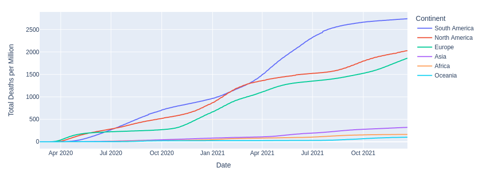
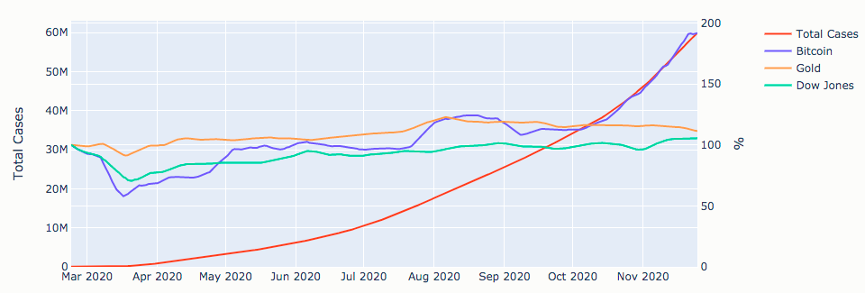

Comprehensive Python Cheatsheet
===============================
<sup>[Download text file](https://raw.githubusercontent.com/gto76/python-cheatsheet/main/README.md), [Buy PDF](https://transactions.sendowl.com/products/78175486/4422834F/view), [Fork me on GitHub](https://github.com/gto76/python-cheatsheet) or [Check out FAQ](https://github.com/gto76/python-cheatsheet/wiki/Frequently-Asked-Questions).
</sup>


Contents
--------
**&nbsp;&nbsp;&nbsp;** **1. Collections:** **&nbsp;** **[`List`](#list)**__,__ **[`Dictionary`](#dictionary)**__,__ **[`Set`](#set)**__,__ **[`Tuple`](#tuple)**__,__ **[`Range`](#range)**__,__ **[`Enumerate`](#enumerate)**__,__ **[`Iterator`](#iterator)**__,__ **[`Generator`](#generator)**__.__  
**&nbsp;&nbsp;&nbsp;** **2. Types:** **&nbsp;&nbsp;&nbsp;&nbsp;&nbsp;&nbsp;&nbsp;&nbsp;&nbsp;&nbsp;**  **[`Type`](#type)**__,__ **[`String`](#string)**__,__ **[`Regular_Exp`](#regex)**__,__ **[`Format`](#format)**__,__ **[`Numbers`](#numbers-1)**__,__ **[`Combinatorics`](#combinatorics)**__,__ **[`Datetime`](#datetime)**__.__  
**&nbsp;&nbsp;&nbsp;** **3. Syntax:** **&nbsp;&nbsp;&nbsp;&nbsp;&nbsp;&nbsp;&nbsp;&nbsp;&nbsp;**  **[`Args`](#arguments)**__,__ **[`Inline`](#inline)**__,__ **[`Closure`](#closure)**__,__ **[`Decorator`](#decorator)**__,__ **[`Class`](#class)**__,__ **[`Duck_Type`](#duck-types)**__,__ **[`Enum`](#enum)**__,__ **[`Exception`](#exceptions)**__.__  
**&nbsp;&nbsp;&nbsp;** **4. System:** **&nbsp;&nbsp;&nbsp;&nbsp;&nbsp;&nbsp;&nbsp;&nbsp;**  **[`Exit`](#exit)**__,__ **[`Print`](#print)**__,__ **[`Input`](#input)**__,__ **[`Command_Line_Arguments`](#command-line-arguments)**__,__ **[`Open`](#open)**__,__ **[`Path`](#paths)**__,__ **[`OS_Commands`](#os-commands)**__.__  
**&nbsp;&nbsp;&nbsp;** **5. Data:** **&nbsp;&nbsp;&nbsp;&nbsp;&nbsp;&nbsp;&nbsp;&nbsp;&nbsp;&nbsp;&nbsp;&nbsp;&nbsp;**  **[`JSON`](#json)**__,__ **[`Pickle`](#pickle)**__,__ **[`CSV`](#csv)**__,__ **[`SQLite`](#sqlite)**__,__ **[`Bytes`](#bytes)**__,__ **[`Struct`](#struct)**__,__ **[`Array`](#array)**__,__ **[`Memory_View`](#memory-view)**__,__ **[`Deque`](#deque)**__.__  
**&nbsp;&nbsp;&nbsp;** **6. Advanced:** **&nbsp;&nbsp;&nbsp;**  **[`Threading`](#threading)**__,__ **[`Operator`](#operator)**__,__ **[`Introspection`](#introspection)**__,__ **[`Metaprograming`](#metaprogramming)**__,__ **[`Eval`](#eval)**__,__ **[`Coroutines`](#coroutines)**__.__  
**&nbsp;&nbsp;&nbsp;** **7. Libraries:** **&nbsp;&nbsp;&nbsp;&nbsp;&nbsp;&nbsp;**  **[`Progress_Bar`](#progress-bar)**__,__ **[`Plot`](#plot)**__,__ **[`Table`](#table)**__,__ **[`Curses`](#curses)**__,__ **[`Logging`](#logging)**__,__ **[`Scraping`](#scraping)**__,__ **[`Web`](#web)**__,__ **[`Profile`](#profiling)**__,__  
**&nbsp;&nbsp;&nbsp;&nbsp;&nbsp;&nbsp;&nbsp;&nbsp;&nbsp;&nbsp;&nbsp;&nbsp;&nbsp;&nbsp;&nbsp;&nbsp;&nbsp;&nbsp;&nbsp;&nbsp;&nbsp;&nbsp;&nbsp;&nbsp;&nbsp;&nbsp;&nbsp;&nbsp;&nbsp;&nbsp;&nbsp;&nbsp;&nbsp;** **[`NumPy`](#numpy)**__,__ **[`Image`](#image)**__,__ **[`Audio`](#audio)**__,__ **[`Games`](#pygame)**__,__ **[`Data`](#pandas)**__.__


Main
----
```python
if __name__ == '__main__':     # Runs main() if file wasn't imported.
    main()
```


List
----
```python
<list> = <list>[from_inclusive : to_exclusive : ±step_size]
```

```python
<list>.append(<el>)            # Or: <list> += [<el>]
<list>.extend(<collection>)    # Or: <list> += <collection>
```

```python
<list>.sort()
<list>.reverse()
<list> = sorted(<collection>)
<iter> = reversed(<list>)
```

```python
sum_of_elements  = sum(<collection>)
elementwise_sum  = [sum(pair) for pair in zip(list_a, list_b)]
sorted_by_second = sorted(<collection>, key=lambda el: el[1])
sorted_by_both   = sorted(<collection>, key=lambda el: (el[1], el[0]))
flatter_list     = list(itertools.chain.from_iterable(<list>))
product_of_elems = functools.reduce(lambda out, el: out * el, <collection>)
list_of_chars    = list(<str>)
```
* **Module [operator](#operator) provides functions itemgetter() and mul() that offer the same functionality as [lambda](#lambda) expressions above.**

```python
<list>.insert(<int>, <el>)     # Inserts item at index and moves the rest to the right.
<el>  = <list>.pop([<int>])    # Returns and removes item at index or from the end.
<int> = <list>.count(<el>)     # Returns number of occurrences. Also works on strings.
<int> = <list>.index(<el>)     # Returns index of the first occurrence or raises ValueError.
<list>.remove(<el>)            # Removes first occurrence of the item or raises ValueError.
<list>.clear()                 # Removes all items. Also works on dictionary and set.
```


Dictionary
----------
```python
<view> = <dict>.keys()                          # Coll. of keys that reflects changes.
<view> = <dict>.values()                        # Coll. of values that reflects changes.
<view> = <dict>.items()                         # Coll. of key-value tuples that reflects chgs.
```

```python
value  = <dict>.get(key, default=None)          # Returns default if key is missing.
value  = <dict>.setdefault(key, default=None)   # Returns and writes default if key is missing.
<dict> = collections.defaultdict(<type>)        # Creates a dict with default value of type.
<dict> = collections.defaultdict(lambda: 1)     # Creates a dict with default value 1.
```

```python
<dict> = dict(<collection>)                     # Creates a dict from coll. of key-value pairs.
<dict> = dict(zip(keys, values))                # Creates a dict from two collections.
<dict> = dict.fromkeys(keys [, value])          # Creates a dict from collection of keys.
```

```python
<dict>.update(<dict>)                           # Adds items. Replaces ones with matching keys.
value = <dict>.pop(key)                         # Removes item or raises KeyError.
{k for k, v in <dict>.items() if v == value}    # Returns set of keys that point to the value.
{k: v for k, v in <dict>.items() if k in keys}  # Returns a dictionary, filtered by keys.
```

### Counter
```python
>>> from collections import Counter
>>> colors = ['blue', 'blue', 'blue', 'red', 'red']
>>> counter = Counter(colors)
>>> counter['yellow'] += 1
Counter({'blue': 3, 'red': 2, 'yellow': 1})
>>> counter.most_common()[0]
('blue', 3)
```


Set
---
```python
<set> = set()
```

```python
<set>.add(<el>)                                 # Or: <set> |= {<el>}
<set>.update(<collection> [, ...])              # Or: <set> |= <set>
```

```python
<set>  = <set>.union(<coll.>)                   # Or: <set> | <set>
<set>  = <set>.intersection(<coll.>)            # Or: <set> & <set>
<set>  = <set>.difference(<coll.>)              # Or: <set> - <set>
<set>  = <set>.symmetric_difference(<coll.>)    # Or: <set> ^ <set>
<bool> = <set>.issubset(<coll.>)                # Or: <set> <= <set>
<bool> = <set>.issuperset(<coll.>)              # Or: <set> >= <set>
```

```python
<el> = <set>.pop()                              # Raises KeyError if empty.
<set>.remove(<el>)                              # Raises KeyError if missing.
<set>.discard(<el>)                             # Doesn't raise an error.
```

### Frozen Set
* **Is immutable and hashable.**
* **That means it can be used as a key in a dictionary or as an element in a set.**
```python
<frozenset> = frozenset(<collection>)
```


Tuple
-----
**Tuple is an immutable and hashable list.**
```python
<tuple> = ()
<tuple> = (<el>,)                           # Or: <el>,
<tuple> = (<el_1>, <el_2> [, ...])          # Or: <el_1>, <el_2> [, ...]
```

### Named Tuple
**Tuple's subclass with named elements.**

```python
>>> from collections import namedtuple
>>> Point = namedtuple('Point', 'x y')
>>> p = Point(1, y=2)
Point(x=1, y=2)
>>> p[0]
1
>>> p.x
1
>>> getattr(p, 'y')
2
>>> p._fields  # Or: Point._fields
('x', 'y')
```


Range
-----
```python
<range> = range(to_exclusive)
<range> = range(from_inclusive, to_exclusive)
<range> = range(from_inclusive, to_exclusive, ±step_size)
```

```python
from_inclusive = <range>.start
to_exclusive   = <range>.stop
```


Enumerate
---------
```python
for i, el in enumerate(<collection> [, i_start]):
    ...
```


Iterator
--------
```python
<iter> = iter(<collection>)                 # `iter(<iter>)` returns unmodified iterator.
<iter> = iter(<function>, to_exclusive)     # A sequence of return values until 'to_exclusive'.
<el>   = next(<iter> [, default])           # Raises StopIteration or returns 'default' on end.
<list> = list(<iter>)                       # Returns a list of iterator's remaining elements.
```

### Itertools
```python
from itertools import count, repeat, cycle, chain, islice
```

```python
<iter> = count(start=0, step=1)             # Returns updated value endlessly. Accepts floats.
<iter> = repeat(<el> [, times])             # Returns element endlessly or 'times' times.
<iter> = cycle(<collection>)                # Repeats the sequence endlessly.
```

```python
<iter> = chain(<coll_1>, <coll_2> [, ...])  # Empties collections in order.
<iter> = chain.from_iterable(<collection>)  # Empties collections inside a collection in order.
```

```python
<iter> = islice(<coll>, to_exclusive)       # Only returns first 'to_exclusive' elements.
<iter> = islice(<coll>, from_inclusive, …)  # `to_exclusive, step_size`.
```


Generator
---------
* **Any function that contains a yield statement returns a generator.**
* **Generators and iterators are interchangeable.**

```python
def count(start, step):
    while True:
        yield start
        start += step
```

```python
>>> counter = count(10, 2)
>>> next(counter), next(counter), next(counter)
(10, 12, 14)
```


Type
----
* **Everything is an object.**
* **Every object has a type.**
* **Type and class are synonymous.**

```python
<type> = type(<el>)                          # Or: <el>.__class__
<bool> = isinstance(<el>, <type>)            # Or: issubclass(type(<el>), <type>)
```

```python
>>> type('a'), 'a'.__class__, str
(<class 'str'>, <class 'str'>, <class 'str'>)
```

#### Some types do not have built-in names, so they must be imported:
```python
from types import FunctionType, MethodType, LambdaType, GeneratorType
```

### Abstract Base Classes
**Each abstract base class specifies a set of virtual subclasses. These classes are then recognized by isinstance() and issubclass() as subclasses of the ABC, although they are really not. ABC can also manually decide whether or not a specific class is its virtual subclass, usually based on which methods the class has implemented. For instance, Iterable ABC looks for method iter() while Collection ABC looks for methods iter(), contains() and len().**

```python
>>> from collections.abc import Sequence, Collection, Iterable
>>> isinstance([1, 2, 3], Iterable)
True
```

```text
+------------------+------------+------------+------------+
|                  |  Sequence  | Collection |  Iterable  |
+------------------+------------+------------+------------+
| list, range, str |    yes     |    yes     |    yes     |
| dict, set        |            |    yes     |    yes     |
| iter             |            |            |    yes     |
+------------------+------------+------------+------------+
```

```python
>>> from numbers import Integral, Rational, Real, Complex, Number
>>> isinstance(123, Number)
True
```

```text
+--------------------+----------+----------+----------+----------+----------+
|                    | Integral | Rational |   Real   | Complex  |  Number  |
+--------------------+----------+----------+----------+----------+----------+
| int                |   yes    |   yes    |   yes    |   yes    |   yes    |
| fractions.Fraction |          |   yes    |   yes    |   yes    |   yes    |
| float              |          |          |   yes    |   yes    |   yes    |
| complex            |          |          |          |   yes    |   yes    |
| decimal.Decimal    |          |          |          |          |   yes    |
+--------------------+----------+----------+----------+----------+----------+
```


String
------
```python
<str>  = <str>.strip()                       # Strips all whitespace characters from both ends.
<str>  = <str>.strip('<chars>')              # Strips all passed characters from both ends.
```

```python
<list> = <str>.split()                       # Splits on one or more whitespace characters.
<list> = <str>.split(sep=None, maxsplit=-1)  # Splits on 'sep' str at most 'maxsplit' times.
<list> = <str>.splitlines(keepends=False)    # Splits on [\n\r\f\v\x1c\x1d\x1e\x85] and '\r\n'.
<str>  = <str>.join(<coll_of_strings>)       # Joins elements using string as a separator.
```

```python
<bool> = <sub_str> in <str>                  # Checks if string contains a substring.
<bool> = <str>.startswith(<sub_str>)         # Pass tuple of strings for multiple options.
<bool> = <str>.endswith(<sub_str>)           # Pass tuple of strings for multiple options.
<int>  = <str>.find(<sub_str>)               # Returns start index of the first match or -1.
<int>  = <str>.index(<sub_str>)              # Same but raises ValueError if missing.
```

```python
<str>  = <str>.replace(old, new [, count])   # Replaces 'old' with 'new' at most 'count' times.
<str>  = <str>.translate(<table>)            # Use `str.maketrans(<dict>)` to generate table.
```

```python
<str>  = chr(<int>)                          # Converts int to Unicode char.
<int>  = ord(<str>)                          # Converts Unicode char to int.
```
* **Also: `'lstrip()'`, `'rstrip()'`.**
* **Also: `'lower()'`, `'upper()'`, `'capitalize()'` and `'title()'`.**

### Property Methods
```text
+---------------+----------+----------+----------+----------+----------+
|               | [ !#$%…] | [a-zA-Z] |  [¼½¾]   |  [²³¹]   |  [0-9]   |
+---------------+----------+----------+----------+----------+----------+
| isprintable() |   yes    |   yes    |   yes    |   yes    |   yes    |
| isalnum()     |          |   yes    |   yes    |   yes    |   yes    |
| isnumeric()   |          |          |   yes    |   yes    |   yes    |
| isdigit()     |          |          |          |   yes    |   yes    |
| isdecimal()   |          |          |          |          |   yes    |
+---------------+----------+----------+----------+----------+----------+
```
* **Also: `'isspace()'` checks for `'[ \t\n\r\f\v…]'`.**


Regex
-----
```python
import re
<str>   = re.sub(<regex>, new, text, count=0)  # Substitutes all occurrences with 'new'.
<list>  = re.findall(<regex>, text)            # Returns all occurrences as strings.
<list>  = re.split(<regex>, text, maxsplit=0)  # Use brackets in regex to include the matches.
<Match> = re.search(<regex>, text)             # Searches for first occurrence of the pattern.
<Match> = re.match(<regex>, text)              # Searches only at the beginning of the text.
<iter>  = re.finditer(<regex>, text)           # Returns all occurrences as match objects.
```

* **Search() and match() return None if they can't find a match.**
* **Argument `'flags=re.IGNORECASE'` can be used with all functions.**
* **Argument `'flags=re.MULTILINE'` makes `'^'` and `'$'` match the start/end of each line.**
* **Argument `'flags=re.DOTALL'` makes dot also accept the `'\n'`.**
* **Use `r'\1'` or `'\\1'` for backreference.**
* **Add `'?'` after an operator to make it non-greedy.**

### Match Object
```python
<str>   = <Match>.group()                      # Returns the whole match. Also group(0).
<str>   = <Match>.group(1)                     # Returns part in the first bracket.
<tuple> = <Match>.groups()                     # Returns all bracketed parts.
<int>   = <Match>.start()                      # Returns start index of the match.
<int>   = <Match>.end()                        # Returns exclusive end index of the match.
```

### Special Sequences
* **By default, decimal characters, alphanumerics and whitespaces from all alphabets are matched unless `'flags=re.ASCII'` argument is used.**
* **As shown below, it restricts special sequence matches to the first 128 characters and prevents `'\s'` from accepting `'[\x1c-\x1f]'`.**
* **Use a capital letter for negation.**
```python
'\d' == '[0-9]'                                # Matches decimal characters.
'\w' == '[a-zA-Z0-9_]'                         # Matches alphanumerics and underscore.
'\s' == '[ \t\n\r\f\v]'                        # Matches whitespaces.
```


Format
------
```python
<str> = f'{<el_1>}, {<el_2>}'
<str> = '{}, {}'.format(<el_1>, <el_2>)
```

### Attributes
```python
>>> from collections import namedtuple
>>> Person = namedtuple('Person', 'name height')
>>> person = Person('Jean-Luc', 187)
>>> f'{person.height}'
'187'
>>> '{p.height}'.format(p=person)
'187'
```

### General Options
```python
{<el>:<10}                                     # '<el>      '
{<el>:^10}                                     # '   <el>   '
{<el>:>10}                                     # '      <el>'
{<el>:.<10}                                    # '<el>......'
{<el>:0}                                       # '<el>'
```
* **Use `'{<el>:{<str/int/float>}[...]}'` to set options dynamically.**
* **Adding `'!r'` before the colon converts object to string by calling its [repr()](#class) method.**

### Strings
```python
{'abcde'!r:10}                                 # "'abcde'   "
{'abcde':10.3}                                 # 'abc       '
{'abcde':.3}                                   # 'abc'
```

### Numbers
```python
{ 123456:10,}                                  # '   123,456'
{ 123456:10_}                                  # '   123_456'
{ 123456:+10}                                  # '   +123456'
{-123456:=10}                                  # '-   123456'
{ 123456: }                                    # ' 123456'
{-123456: }                                    # '-123456'
```

### Floats
```python
{1.23456:10.3}                                 # '      1.23'
{1.23456:10.3f}                                # '     1.235'
{1.23456:10.3e}                                # ' 1.235e+00'
{1.23456:10.3%}                                # '  123.456%'
```

#### Comparison of presentation types:
```text
+--------------+----------------+----------------+----------------+----------------+
|              |    {<float>}   |   {<float>:f}  |   {<float>:e}  |   {<float>:%}  |
+--------------+----------------+----------------+----------------+----------------+
|  0.000056789 |   '5.6789e-05' |    '0.000057'  | '5.678900e-05' |    '0.005679%' |
|  0.00056789  |   '0.00056789' |    '0.000568'  | '5.678900e-04' |    '0.056789%' |
|  0.0056789   |   '0.0056789'  |    '0.005679'  | '5.678900e-03' |    '0.567890%' |
|  0.056789    |   '0.056789'   |    '0.056789'  | '5.678900e-02' |    '5.678900%' |
|  0.56789     |   '0.56789'    |    '0.567890'  | '5.678900e-01' |   '56.789000%' |
|  5.6789      |   '5.6789'     |    '5.678900'  | '5.678900e+00' |  '567.890000%' |
| 56.789       |  '56.789'      |   '56.789000'  | '5.678900e+01' | '5678.900000%' |
+--------------+----------------+----------------+----------------+----------------+
```
```text
+--------------+----------------+----------------+----------------+----------------+
|              |  {<float>:.2}  |  {<float>:.2f} |  {<float>:.2e} |  {<float>:.2%} |
+--------------+----------------+----------------+----------------+----------------+
|  0.000056789 |    '5.7e-05'   |      '0.00'    |   '5.68e-05'   |      '0.01%'   |
|  0.00056789  |    '0.00057'   |      '0.00'    |   '5.68e-04'   |      '0.06%'   |
|  0.0056789   |    '0.0057'    |      '0.01'    |   '5.68e-03'   |      '0.57%'   |
|  0.056789    |    '0.057'     |      '0.06'    |   '5.68e-02'   |      '5.68%'   |
|  0.56789     |    '0.57'      |      '0.57'    |   '5.68e-01'   |     '56.79%'   |
|  5.6789      |    '5.7'       |      '5.68'    |   '5.68e+00'   |    '567.89%'   |
| 56.789       |    '5.7e+01'   |     '56.79'    |   '5.68e+01'   |   '5678.90%'   |
+--------------+----------------+----------------+----------------+----------------+
```
* **When both rounding up and rounding down are possible, the one that returns result with even last digit is chosen. That makes `'{6.5:.0f}'` a `'6'` and `'{7.5:.0f}'` an `'8'`.**

### Ints
```python
{90:c}                                   # 'Z'
{90:b}                                   # '1011010'
{90:X}                                   # '5A'
```


Numbers
-------
### Types
```python
<int>      = int(<float/str/bool>)       # Or: math.floor(<float>)
<float>    = float(<int/str/bool>)       # Or: <real>e±<int>
<complex>  = complex(real=0, imag=0)     # Or: <real> ± <real>j
<Fraction> = fractions.Fraction(0, 1)    # Or: Fraction(numerator=0, denominator=1)
<Decimal>  = decimal.Decimal(<str/int>)  # Or: Decimal((sign, digits, exponent))
```
* **`'int(<str>)'` and `'float(<str>)'` raise ValueError on malformed strings.**
* **Decimal numbers can be represented exactly, unlike floats where `'1.1 + 2.2 != 3.3'`.**
* **Precision of decimal operations is set with: `'decimal.getcontext().prec = <int>'`.**

### Basic Functions
```python
<num> = pow(<num>, <num>)                # Or: <num> ** <num>
<num> = abs(<num>)                       # <float> = abs(<complex>)
<num> = round(<num> [, ±ndigits])        # `round(126, -1) == 130`
```

### Math
```python
from math import e, pi, inf, nan, isinf, isnan
from math import sin, cos, tan, asin, acos, atan, degrees, radians
from math import log, log10, log2
```

### Statistics
```python
from statistics import mean, median, variance, stdev, pvariance, pstdev
```

### Random
```python
from random import random, randint, choice, shuffle, gauss, seed

<float> = random()                       # A float inside [0, 1).
<int>   = randint(from_inc, to_inc)      # An int inside [from_inc, to_inc].
<el>    = choice(<list>)                 # Keeps the list intact.
```

### Bin, Hex
```python
<int> = ±0b<bin>                         # Or: ±0x<hex>
<int> = int('±<bin>', 2)                 # Or: int('±<hex>', 16)
<int> = int('±0b<bin>', 0)               # Or: int('±0x<hex>', 0)
<str> = bin(<int>)                       # Returns '[-]0b<bin>'.
```

### Bitwise Operators
```python
<int> = <int> & <int>                    # And
<int> = <int> | <int>                    # Or
<int> = <int> ^ <int>                    # Xor (0 if both bits equal)
<int> = <int> << n_bits                  # Left shift (>> for right)
<int> = ~<int>                           # Not (also: -<int> - 1)
```


Combinatorics
-------------
* **Every function returns an iterator.**
* **If you want to print the iterator, you need to pass it to the list() function first!**

```python
from itertools import product, combinations, combinations_with_replacement, permutations
```

```python
>>> product([0, 1], repeat=3)
[(0, 0, 0), (0, 0, 1), (0, 1, 0), (0, 1, 1), ..., (1, 1, 1)]
```

```python
>>> product('abc', 'abc')                    #   a  b  c
[('a', 'a'), ('a', 'b'), ('a', 'c'),         # a x  x  x
 ('b', 'a'), ('b', 'b'), ('b', 'c'),         # b x  x  x
 ('c', 'a'), ('c', 'b'), ('c', 'c')]         # c x  x  x
```

```python
>>> combinations('abc', 2)                   #   a  b  c
[('a', 'b'), ('a', 'c'),                     # a .  x  x
 ('b', 'c')]                                 # b .  .  x
```

```python
>>> combinations_with_replacement('abc', 2)  #   a  b  c
[('a', 'a'), ('a', 'b'), ('a', 'c'),         # a x  x  x
 ('b', 'b'), ('b', 'c'),                     # b .  x  x
 ('c', 'c')]                                 # c .  .  x
```

```python
>>> permutations('abc', 2)                   #   a  b  c
[('a', 'b'), ('a', 'c'),                     # a .  x  x
 ('b', 'a'), ('b', 'c'),                     # b x  .  x
 ('c', 'a'), ('c', 'b')]                     # c x  x  .
```


Datetime
--------
* **Module 'datetime' provides 'date' `<D>`, 'time' `<T>`, 'datetime' `<DT>` and 'timedelta' `<TD>` classes. All are immutable and hashable.**
* **Time and datetime objects can be 'aware' `<a>`, meaning they have defined timezone, or 'naive' `<n>`, meaning they don't.**
* **If object is naive, it is presumed to be in the system's timezone.**

```python
from datetime import date, time, datetime, timedelta
from dateutil.tz import UTC, tzlocal, gettz, datetime_exists, resolve_imaginary
```

### Constructors
```python
<D>  = date(year, month, day)
<T>  = time(hour=0, minute=0, second=0, microsecond=0, tzinfo=None, fold=0)
<DT> = datetime(year, month, day, hour=0, minute=0, second=0, ...)
<TD> = timedelta(days=0, seconds=0, microseconds=0, milliseconds=0,
                 minutes=0, hours=0, weeks=0)
```
* **Use `'<D/DT>.weekday()'` to get the day of the week (Mon == 0).**
* **`'fold=1'` means the second pass in case of time jumping back for one hour.**
* **`'<DTa> = resolve_imaginary(<DTa>)'` fixes DTs that fall into the missing hour.**

### Now
```python
<D/DTn>  = D/DT.today()                     # Current local date or naive datetime.
<DTn>    = DT.utcnow()                      # Naive datetime from current UTC time.
<DTa>    = DT.now(<tzinfo>)                 # Aware datetime from current tz time.
```
* **To extract time use `'<DTn>.time()'`, `'<DTa>.time()'` or `'<DTa>.timetz()'`.**

### Timezone
```python
<tzinfo> = UTC                              # UTC timezone. London without DST.
<tzinfo> = tzlocal()                        # Local timezone. Also gettz().
<tzinfo> = gettz('<Continent>/<City>')      # 'Continent/City_Name' timezone or None.
<DTa>    = <DT>.astimezone(<tzinfo>)        # Datetime, converted to the passed timezone.
<Ta/DTa> = <T/DT>.replace(tzinfo=<tzinfo>)  # Unconverted object with a new timezone.
```

### Encode
```python
<D/T/DT> = D/T/DT.fromisoformat('<iso>')    # Object from ISO string. Raises ValueError.
<DT>     = DT.strptime(<str>, '<format>')   # Datetime from str, according to format.
<D/DTn>  = D/DT.fromordinal(<int>)          # D/DTn from days since the Gregorian NYE 1.
<DTn>    = DT.fromtimestamp(<real>)         # Local time DTn from seconds since the Epoch.
<DTa>    = DT.fromtimestamp(<real>, <tz.>)  # Aware datetime from seconds since the Epoch.
```
* **ISO strings come in following forms: `'YYYY-MM-DD'`, `'HH:MM:SS.ffffff[±<offset>]'`, or both separated by an arbitrary character. Offset is formatted as: `'HH:MM'`.**
* **Epoch on Unix systems is: `'1970-01-01 00:00 UTC'`, `'1970-01-01 01:00 CET'`, ...**

### Decode
```python
<str>    = <D/T/DT>.isoformat(sep='T')      # Also timespec='auto/hours/minutes/seconds'.
<str>    = <D/T/DT>.strftime('<format>')    # Custom string representation.
<int>    = <D/DT>.toordinal()               # Days since Gregorian NYE 1, ignoring time and tz.
<float>  = <DTn>.timestamp()                # Seconds since the Epoch, from DTn in local tz.
<float>  = <DTa>.timestamp()                # Seconds since the Epoch, from DTa.
```

### Format
```python
>>> from datetime import datetime
>>> dt = datetime.strptime('2015-05-14 23:39:00.00 +0200', '%Y-%m-%d %H:%M:%S.%f %z')
>>> dt.strftime("%A, %dth of %B '%y, %I:%M%p %Z")
"Thursday, 14th of May '15, 11:39PM UTC+02:00"
```
* **When parsing, `'%z'` also accepts `'±HH:MM'`.**
* **For abbreviated weekday and month use `'%a'` and `'%b'`.**

### Arithmetics
```python
<D/DT>   = <D/DT>   ± <TD>                  # Returned datetime can fall into missing hour.
<TD>     = <D/DTn>  - <D/DTn>               # Returns the difference, ignoring time jumps.
<TD>     = <DTa>    - <DTa>                 # Ignores time jumps if they share tzinfo object.
<TD>     = <DT_UTC> - <DT_UTC>              # Convert DTs to UTC to get the actual delta.
```


Arguments
---------
### Inside Function Call
```python
<function>(<positional_args>)                  # f(0, 0)
<function>(<keyword_args>)                     # f(x=0, y=0)
<function>(<positional_args>, <keyword_args>)  # f(0, y=0)
```

### Inside Function Definition
```python
def f(<nondefault_args>):                      # def f(x, y):
def f(<default_args>):                         # def f(x=0, y=0):
def f(<nondefault_args>, <default_args>):      # def f(x, y=0):
```


Splat Operator
--------------
### Inside Function Call
**Splat expands a collection into positional arguments, while splatty-splat expands a dictionary into keyword arguments.**
```python
args   = (1, 2)
kwargs = {'x': 3, 'y': 4, 'z': 5}
func(*args, **kwargs)
```

#### Is the same as:
```python
func(1, 2, x=3, y=4, z=5)
```

### Inside Function Definition
**Splat combines zero or more positional arguments into a tuple, while splatty-splat combines zero or more keyword arguments into a dictionary.**
```python
def add(*a):
    return sum(a)
```

```python
>>> add(1, 2, 3)
6
```

#### Legal argument combinations:
```python
def f(x, y, z):                # f(x=1, y=2, z=3) | f(1, y=2, z=3) | f(1, 2, z=3) | f(1, 2, 3)
def f(*, x, y, z):             # f(x=1, y=2, z=3)
def f(x, *, y, z):             # f(x=1, y=2, z=3) | f(1, y=2, z=3)
def f(x, y, *, z):             # f(x=1, y=2, z=3) | f(1, y=2, z=3) | f(1, 2, z=3)
```

```python
def f(*args):                  # f(1, 2, 3)
def f(x, *args):               # f(1, 2, 3)
def f(*args, z):               # f(1, 2, z=3)
def f(x, *args, z):            # f(1, 2, z=3)
```

```python
def f(**kwargs):               # f(x=1, y=2, z=3)
def f(x, **kwargs):            # f(x=1, y=2, z=3) | f(1, y=2, z=3)
def f(*, x, **kwargs):         # f(x=1, y=2, z=3)
```

```python
def f(*args, **kwargs):        # f(x=1, y=2, z=3) | f(1, y=2, z=3) | f(1, 2, z=3) | f(1, 2, 3)
def f(x, *args, **kwargs):     # f(x=1, y=2, z=3) | f(1, y=2, z=3) | f(1, 2, z=3) | f(1, 2, 3)
def f(*args, y, **kwargs):     # f(x=1, y=2, z=3) | f(1, y=2, z=3)
def f(x, *args, z, **kwargs):  # f(x=1, y=2, z=3) | f(1, y=2, z=3) | f(1, 2, z=3)
```

### Other Uses
```python
<list> = [*<collection> [, ...]]
<set>  = {*<collection> [, ...]}
<tup.> = (*<collection>, [...])
<dict> = {**<dict> [, ...]}
```

```python
head, *body, tail = <collection>
```


Inline
------
### Lambda
```python
<func> = lambda: <return_value>
<func> = lambda <arg_1>, <arg_2>: <return_value>
```

### Comprehensions
```python
<list> = [i+1 for i in range(10)]                         # [1, 2, ..., 10]
<set>  = {i for i in range(10) if i > 5}                  # {6, 7, 8, 9}
<iter> = (i+5 for i in range(10))                         # (5, 6, ..., 14)
<dict> = {i: i*2 for i in range(10)}                      # {0: 0, 1: 2, ..., 9: 18}
```

```python
>>> [l+r for l in 'abc' for r in 'abc']
['aa', 'ab', 'ac', ..., 'cc']
```

### Map, Filter, Reduce
```python
<iter> = map(lambda x: x + 1, range(10))                  # (1, 2, ..., 10)
<iter> = filter(lambda x: x > 5, range(10))               # (6, 7, 8, 9)
<obj>  = reduce(lambda out, x: out + x, range(10))        # 45
```
* **Reduce must be imported from functools module.**

### Any, All
```python
<bool> = any(<collection>)                                # False if empty.
<bool> = all(el[1] for el in <collection>)                # True if empty.
```

### Conditional Expression
```python
<obj> = <exp_if_true> if <condition> else <exp_if_false>
```

```python
>>> [a if a else 'zero' for a in (0, 1, 2, 3)]
['zero', 1, 2, 3]
```

### Namedtuple, Enum, Dataclass
```python
from collections import namedtuple
Point     = namedtuple('Point', 'x y')
point     = Point(0, 0)
```

```python
from enum import Enum
Direction = Enum('Direction', 'n e s w')
direction = Direction.n
```

```python
from dataclasses import make_dataclass
Creature  = make_dataclass('Creature', ['loc', 'dir'])
creature  = Creature(Point(0, 0), Direction.n)
```


Closure
-------
**We have a closure in Python when:**
* **A nested function references a value of its enclosing function and then**
* **the enclosing function returns the nested function.**

```python
def get_multiplier(a):
    def out(b):
        return a * b
    return out
```

```python
>>> multiply_by_3 = get_multiplier(3)
>>> multiply_by_3(10)
30
```

* **If multiple nested functions within enclosing function reference the same value, that value gets shared.**
* **To dynamically access function's first free variable use `'<function>.__closure__[0].cell_contents'`.**

### Partial
```python
from functools import partial
<function> = partial(<function> [, <arg_1>, <arg_2>, ...])
```

```python
>>> import operator as op
>>> multiply_by_3 = partial(op.mul, 3)
>>> multiply_by_3(10)
30
```
* **Partial is also useful in cases when function needs to be passed as an argument, because it enables us to set its arguments beforehand.**
* **A few examples being: `'defaultdict(<function>)'`, `'iter(<function>, to_exclusive)'` and dataclass's `'field(default_factory=<function>)'`.**

### Non-Local
**If variable is being assigned to anywhere in the scope, it is regarded as a local variable, unless it is declared as a 'global' or a 'nonlocal'.**

```python
def get_counter():
    i = 0
    def out():
        nonlocal i
        i += 1
        return i
    return out
```

```python
>>> counter = get_counter()
>>> counter(), counter(), counter()
(1, 2, 3)
```


Decorator
---------
**A decorator takes a function, adds some functionality and returns it.**

```python
@decorator_name
def function_that_gets_passed_to_decorator():
    ...
```

### Debugger Example
**Decorator that prints function's name every time it gets called.**

```python
from functools import wraps

def debug(func):
    @wraps(func)
    def out(*args, **kwargs):
        print(func.__name__)
        return func(*args, **kwargs)
    return out

@debug
def add(x, y):
    return x + y
```
* **Wraps is a helper decorator that copies the metadata of the passed function (func) to the function it is wrapping (out).**
* **Without it `'add.__name__'` would return `'out'`.**

### LRU Cache
**Decorator that caches function's return values. All function's arguments must be hashable.**

```python
from functools import lru_cache

@lru_cache(maxsize=None)
def fib(n):
    return n if n < 2 else fib(n-2) + fib(n-1)
```
* **CPython interpreter limits recursion depth to 1000 by default. To increase it use `'sys.setrecursionlimit(<depth>)'`.**

### Parametrized Decorator
**A decorator that accepts arguments and returns a normal decorator that accepts a function.**
```python
from functools import wraps

def debug(print_result=False):
    def decorator(func):
        @wraps(func)
        def out(*args, **kwargs):
            result = func(*args, **kwargs)
            print(func.__name__, result if print_result else '')
            return result
        return out
    return decorator

@debug(print_result=True)
def add(x, y):
    return x + y
```


Class
-----
```python
class <name>:
    def __init__(self, a):
        self.a = a
    def __repr__(self):
        class_name = self.__class__.__name__
        return f'{class_name}({self.a!r})'
    def __str__(self):
        return str(self.a)

    @classmethod
    def get_class_name(cls):
        return cls.__name__
```
* **Return value of repr() should be unambiguous and of str() readable.**
* **If only repr() is defined, it will also be used for str().**

#### Str() use cases:
```python
print(<el>)
print(f'{<el>}')
raise Exception(<el>)
loguru.logger.debug(<el>)
csv.writer(<file>).writerow([<el>])
```

#### Repr() use cases:
```python
print([<el>])
print(f'{<el>!r}')
>>> <el>
loguru.logger.exception()
Z = dataclasses.make_dataclass('Z', ['a']); print(Z(<el>))
```

### Constructor Overloading
```python
class <name>:
    def __init__(self, a=None):
        self.a = a
```

### Inheritance
```python
class Person:
    def __init__(self, name, age):
        self.name = name
        self.age  = age

class Employee(Person):
    def __init__(self, name, age, staff_num):
        super().__init__(name, age)
        self.staff_num = staff_num
```

### Multiple Inheritance
```python
class A: pass
class B: pass
class C(A, B): pass
```

**MRO determines the order in which parent classes are traversed when searching for a method:**
```python
>>> C.mro()
[<class 'C'>, <class 'A'>, <class 'B'>, <class 'object'>]
```

### Property
**Pythonic way of implementing getters and setters.**
```python
class MyClass:
    @property
    def a(self):
        return self._a

    @a.setter
    def a(self, value):
        self._a = value
```

```python
>>> el = MyClass()
>>> el.a = 123
>>> el.a
123
```

### Dataclass
**Decorator that automatically generates init(), repr() and eq() special methods.**
```python
from dataclasses import dataclass, field

@dataclass(order=False, frozen=False)
class <class_name>:
    <attr_name_1>: <type>
    <attr_name_2>: <type> = <default_value>
    <attr_name_3>: list/dict/set = field(default_factory=list/dict/set)
```
* **Objects can be made sortable with `'order=True'` and immutable with `'frozen=True'`.**
* **For object to be hashable, all attributes must be hashable and frozen must be True.**
* **Function field() is needed because `'<attr_name>: list = []'` would make a list that is shared among all instances.**
* **Default_factory can be any [callable](#callable).**

#### Inline:
```python
from dataclasses import make_dataclass
<class> = make_dataclass('<class_name>', <coll_of_attribute_names>)
<class> = make_dataclass('<class_name>', <coll_of_tuples>)
<tuple> = ('<attr_name>', <type> [, <default_value>])
```

### Slots
**Mechanism that restricts objects to attributes listed in 'slots' and significantly reduces their memory footprint.**

```python
class MyClassWithSlots:
    __slots__ = ['a']
    def __init__(self):
        self.a = 1
```

### Copy
```python
from copy import copy, deepcopy

<object> = copy(<object>)
<object> = deepcopy(<object>)
```


Duck Types
----------
**A duck type is an implicit type that prescribes a set of special methods. Any object that has those methods defined is considered a member of that duck type.**

### Comparable
* **If eq() method is not overridden, it returns `'id(self) == id(other)'`, which is the same as `'self is other'`.**
* **That means all objects compare not equal by default.**
* **Only the left side object has eq() method called, unless it returns NotImplemented, in which case the right object is consulted.**

```python
class MyComparable:
    def __init__(self, a):
        self.a = a
    def __eq__(self, other):
        if isinstance(other, type(self)):
            return self.a == other.a
        return NotImplemented
```

### Hashable
* **Hashable object needs both hash() and eq() methods and its hash value should never change.**
* **Hashable objects that compare equal must have the same hash value, meaning default hash() that returns `'id(self)'` will not do.**
* **That is why Python automatically makes classes unhashable if you only implement eq().**

```python
class MyHashable:
    def __init__(self, a):
        self._a = a
    @property
    def a(self):
        return self._a
    def __eq__(self, other):
        if isinstance(other, type(self)):
            return self.a == other.a
        return NotImplemented
    def __hash__(self):
        return hash(self.a)
```

### Sortable
* **With total_ordering decorator, you only need to provide eq() and one of lt(), gt(), le() or ge() special methods.**
```python
from functools import total_ordering

@total_ordering
class MySortable:
    def __init__(self, a):
        self.a = a
    def __eq__(self, other):
        if isinstance(other, type(self)):
            return self.a == other.a
        return NotImplemented
    def __lt__(self, other):
        if isinstance(other, type(self)):
            return self.a < other.a
        return NotImplemented
```

### Iterator
* **Any object that has methods next() and iter() is an iterator.**
* **Next() should return next item or raise StopIteration.**
* **Iter() should return 'self'.**
```python
class Counter:
    def __init__(self):
        self.i = 0
    def __next__(self):
        self.i += 1
        return self.i
    def __iter__(self):
        return self
```

```python
>>> counter = Counter()
>>> next(counter), next(counter), next(counter)
(1, 2, 3)
```

#### Python has many different iterator objects:
* **Sequence iterators returned by the [iter()](#iterator) function, such as list\_iterator and set\_iterator.**
* **Objects returned by the [itertools](#itertools) module, such as count, repeat and cycle.**
* **Generators returned by the [generator functions](#generator) and [generator expressions](#comprehensions).**
* **File objects returned by the [open()](#open) function, etc.**

### Callable
* **All functions and classes have a call() method, hence are callable.**
* **When this cheatsheet uses `'<function>'` as an argument, it actually means `'<callable>'`.**
```python
class Counter:
    def __init__(self):
        self.i = 0
    def __call__(self):
        self.i += 1
        return self.i
```

```python
>>> counter = Counter()
>>> counter(), counter(), counter()
(1, 2, 3)
```

### Context Manager
* **Enter() should lock the resources and optionally return an object.**
* **Exit() should release the resources.**
* **Any exception that happens inside the with block is passed to the exit() method.**
* **If it wishes to suppress the exception it must return a true value.**
```python
class MyOpen:
    def __init__(self, filename):
        self.filename = filename
    def __enter__(self):
        self.file = open(self.filename)
        return self.file
    def __exit__(self, exc_type, exception, traceback):
        self.file.close()
```

```python
>>> with open('test.txt', 'w') as file:
...     file.write('Hello World!')
>>> with MyOpen('test.txt') as file:
...     print(file.read())
Hello World!
```


Iterable Duck Types
-------------------
### Iterable
* **Only required method is iter(). It should return an iterator of object's items.**
* **Contains() automatically works on any object that has iter() defined.**
```python
class MyIterable:
    def __init__(self, a):
        self.a = a
    def __iter__(self):
        return iter(self.a)
    def __contains__(self, el):
        return el in self.a
```

```python
>>> obj = MyIterable([1, 2, 3])
>>> [el for el in obj]
[1, 2, 3]
>>> 1 in obj
True
```

### Collection
* **Only required methods are iter() and len().**
* **This cheatsheet actually means `'<iterable>'` when it uses `'<collection>'`.**
* **I chose not to use the name 'iterable' because it sounds scarier and more vague than 'collection'.**
```python
class MyCollection:
    def __init__(self, a):
        self.a = a
    def __iter__(self):
        return iter(self.a)
    def __contains__(self, el):
        return el in self.a
    def __len__(self):
        return len(self.a)
```

### Sequence
* **Only required methods are len() and getitem().**
* **Getitem() should return an item at index or raise IndexError.**
* **Iter() and contains() automatically work on any object that has getitem() defined.**
* **Reversed() automatically works on any object that has len() and getitem() defined.**
```python
class MySequence:
    def __init__(self, a):
        self.a = a
    def __iter__(self):
        return iter(self.a)
    def __contains__(self, el):
        return el in self.a
    def __len__(self):
        return len(self.a)
    def __getitem__(self, i):
        return self.a[i]
    def __reversed__(self):
        return reversed(self.a)
```

### ABC Sequence
* **It's a richer interface than the basic sequence.**
* **Extending it generates iter(), contains(), reversed(), index() and count().**
* **Unlike `'abc.Iterable'` and `'abc.Collection'`, it is not a duck type. That is why `'issubclass(MySequence, abc.Sequence)'` would return False even if MySequence had all the methods defined.**
```python
from collections import abc

class MyAbcSequence(abc.Sequence):
    def __init__(self, a):
        self.a = a
    def __len__(self):
        return len(self.a)
    def __getitem__(self, i):
        return self.a[i]
```

#### Table of required and automatically available special methods:
```text
+------------+------------+------------+------------+--------------+
|            |  Iterable  | Collection |  Sequence  | abc.Sequence |
+------------+------------+------------+------------+--------------+
| iter()     |    REQ     |    REQ     |    Yes     |     Yes      |
| contains() |    Yes     |    Yes     |    Yes     |     Yes      |
| len()      |            |    REQ     |    REQ     |     REQ      |
| getitem()  |            |            |    REQ     |     REQ      |
| reversed() |            |            |    Yes     |     Yes      |
| index()    |            |            |            |     Yes      |
| count()    |            |            |            |     Yes      |
+------------+------------+------------+------------+--------------+
```
* **Other ABCs that generate missing methods are: MutableSequence, Set, MutableSet, Mapping and MutableMapping.**
* **Names of their required methods are stored in `'<abc>.__abstractmethods__'`.**


Enum
----
```python
from enum import Enum, auto
```

```python
class <enum_name>(Enum):
    <member_name_1> = <value_1>
    <member_name_2> = <value_2_a>, <value_2_b>
    <member_name_3> = auto()
```
* **If there are no numeric values before auto(), it returns 1.**
* **Otherwise it returns an increment of the last numeric value.**

```python
<member> = <enum>.<member_name>                 # Returns a member.
<member> = <enum>['<member_name>']              # Returns a member or raises KeyError.
<member> = <enum>(<value>)                      # Returns a member or raises ValueError.
<str>    = <member>.name                        # Returns member's name.
<obj>    = <member>.value                       # Returns member's value.
```

```python
list_of_members = list(<enum>)
member_names    = [a.name for a in <enum>]
member_values   = [a.value for a in <enum>]
random_member   = random.choice(list(<enum>))
```

```python
def get_next_member(member):
    members = list(member.__class__)
    index   = (members.index(member) + 1) % len(members)
    return members[index]
```

### Inline
```python
Cutlery = Enum('Cutlery', 'fork knife spoon')
Cutlery = Enum('Cutlery', ['fork', 'knife', 'spoon'])
Cutlery = Enum('Cutlery', {'fork': 1, 'knife': 2, 'spoon': 3})
```

#### User-defined functions cannot be values, so they must be wrapped:
```python
from functools import partial
LogicOp = Enum('LogicOp', {'AND': partial(lambda l, r: l and r),
                           'OR' : partial(lambda l, r: l or r)})
```
* **Another solution in this particular case is to use functions and\_() and or\_() from the module [operator](#operator).**


Exceptions
----------
### Basic Example
```python
try:
    <code>
except <exception>:
    <code>
```

### Complex Example
```python
try:
    <code_1>
except <exception_a>:
    <code_2_a>
except <exception_b>:
    <code_2_b>
else:
    <code_2_c>
finally:
    <code_3>
```
* **Code inside the `'else'` block will only be executed if `'try'` block had no exceptions.**
* **Code inside the `'finally'` block will always be executed.**

### Catching Exceptions
```python
except <exception>:
except <exception> as <name>:
except (<exception>, [...]):
except (<exception>, [...]) as <name>:
```
* **Also catches subclasses of the exception.**
* **Use `'traceback.print_exc()'` to print the error message to stderr.**
* **Use `'print(<name>)'` to print just the cause of the exception (its arguments).**

### Raising Exceptions
```python
raise <exception>
raise <exception>()
raise <exception>(<el> [, ...])
```

#### Re-raising caught exception:
```python
except <exception> as <name>:
    ...
    raise
```

### Exception Object
```python
arguments = <name>.args
exc_type  = <name>.__class__
filename  = <name>.__traceback__.tb_frame.f_code.co_filename
func_name = <name>.__traceback__.tb_frame.f_code.co_name
line      = linecache.getline(filename, <name>.__traceback__.tb_lineno)
error_msg = ''.join(traceback.format_exception(exc_type, <name>, <name>.__traceback__))
```

### Built-in Exceptions
```text
BaseException
 +-- SystemExit                   # Raised by the sys.exit() function.
 +-- KeyboardInterrupt            # Raised when the user hits the interrupt key (ctrl-c).
 +-- Exception                    # User-defined exceptions should be derived from this class.
      +-- ArithmeticError         # Base class for arithmetic errors.
      |    +-- ZeroDivisionError  # Raised when dividing by zero.
      +-- AttributeError          # Raised when an attribute is missing.
      +-- EOFError                # Raised by input() when it hits end-of-file condition.
      +-- LookupError             # Raised when a look-up on a collection fails.
      |    +-- IndexError         # Raised when a sequence index is out of range.
      |    +-- KeyError           # Raised when a dictionary key or set element is not found.
      +-- NameError               # Raised when a variable name is not found.
      +-- OSError                 # Errors such as “file not found” or “disk full” (see Open).
      |    +-- FileNotFoundError  # When a file or directory is requested but doesn't exist.
      +-- RuntimeError            # Raised by errors that don't fall into other categories.
      |    +-- RecursionError     # Raised when the maximum recursion depth is exceeded.
      +-- StopIteration           # Raised by next() when run on an empty iterator.
      +-- TypeError               # Raised when an argument is of wrong type.
      +-- ValueError              # When an argument is of right type but inappropriate value.
           +-- UnicodeError       # Raised when encoding/decoding strings to/from bytes fails.
```

#### Collections and their exceptions:
```text
+-----------+------------+------------+------------+
|           |    List    |    Set     |    Dict    |
+-----------+------------+------------+------------+
| getitem() | IndexError |            |  KeyError  |
| pop()     | IndexError |  KeyError  |  KeyError  |
| remove()  | ValueError |  KeyError  |            |
| index()   | ValueError |            |            |
+-----------+------------+------------+------------+
```

#### Useful built-in exceptions:
```python
raise TypeError('Argument is of wrong type!')
raise ValueError('Argument is of right type but inappropriate value!')
raise RuntimeError('None of above!')
```

### User-defined Exceptions
```python
class MyError(Exception):
    pass

class MyInputError(MyError):
    pass
```


Exit
----
**Exits the interpreter by raising SystemExit exception.**
```python
import sys
sys.exit()                        # Exits with exit code 0 (success).
sys.exit(<el>)                    # Prints to stderr and exits with 1.
sys.exit(<int>)                   # Exits with passed exit code.
```


Print
-----
```python
print(<el_1>, ..., sep=' ', end='\n', file=sys.stdout, flush=False)
```
* **Use `'file=sys.stderr'` for messages about errors.**
* **Use `'flush=True'` to forcibly flush the stream.**

### Pretty Print
```python
from pprint import pprint
pprint(<collection>, width=80, depth=None, compact=False, sort_dicts=True)
```
* **Levels deeper than 'depth' get replaced by '...'.**


Input
-----
**Reads a line from user input or pipe if present.**

```python
<str> = input(prompt=None)
```
* **Trailing newline gets stripped.**
* **Prompt string is printed to the standard output before reading input.**
* **Raises EOFError when user hits EOF (ctrl-d/z) or input stream gets exhausted.**


Command Line Arguments
----------------------
```python
import sys
scripts_path = sys.argv[0]
arguments    = sys.argv[1:]
```

### Argument Parser
```python
from argparse import ArgumentParser, FileType
p = ArgumentParser(description=<str>)
p.add_argument('-<short_name>', '--<name>', action='store_true')  # Flag
p.add_argument('-<short_name>', '--<name>', type=<type>)          # Option
p.add_argument('<name>', type=<type>, nargs=1)                    # First argument
p.add_argument('<name>', type=<type>, nargs='+')                  # Remaining arguments
p.add_argument('<name>', type=<type>, nargs='*')                  # Optional arguments
args  = p.parse_args()                                            # Exits on error.
value = args.<name>
```

* **Use `'help=<str>'` to set argument description.**
* **Use `'default=<el>'` to set the default value.**
* **Use `'type=FileType(<mode>)'` for files.**


Open
----
**Opens the file and returns a corresponding file object.**

```python
<file> = open(<path>, mode='r', encoding=None, newline=None)
```
* **`'encoding=None'` means that the default encoding is used, which is platform dependent. Best practice is to use `'encoding="utf-8"'` whenever possible.**
* **`'newline=None'` means all different end of line combinations are converted to '\n' on read, while on write all '\n' characters are converted to system's default line separator.**
* **`'newline=""'` means no conversions take place, but input is still broken into chunks by readline() and readlines() on either '\n', '\r' or '\r\n'.**

### Modes
* **`'r'`  - Read (default).**
* **`'w'`  - Write (truncate).**
* **`'x'`  - Write or fail if the file already exists.**
* **`'a'`  - Append.**
* **`'w+'` - Read and write (truncate).**
* **`'r+'` - Read and write from the start.**
* **`'a+'` - Read and write from the end.**
* **`'t'`  - Text mode (default).**
* **`'b'`  - Binary mode.**

### Exceptions
* **`'FileNotFoundError'` can be raised when reading with `'r'` or `'r+'`.**
* **`'FileExistsError'` can be raised when writing with `'x'`.**
* **`'IsADirectoryError'` and `'PermissionError'` can be raised by any.**
* **`'OSError'` is the parent class of all listed exceptions.**

### File Object
```python
<file>.seek(0)                      # Moves to the start of the file.
<file>.seek(offset)                 # Moves 'offset' chars/bytes from the start.
<file>.seek(0, 2)                   # Moves to the end of the file.
<bin_file>.seek(±offset, <anchor>)  # Anchor: 0 start, 1 current position, 2 end.
```

```python
<str/bytes> = <file>.read(size=-1)  # Reads 'size' chars/bytes or until EOF.
<str/bytes> = <file>.readline()     # Returns a line or empty string/bytes on EOF.
<list>      = <file>.readlines()    # Returns a list of remaining lines.
<str/bytes> = next(<file>)          # Returns a line using buffer. Do not mix.
```

```python
<file>.write(<str/bytes>)           # Writes a string or bytes object.
<file>.writelines(<collection>)     # Writes a coll. of strings or bytes objects.
<file>.flush()                      # Flushes write buffer.
```
* **Methods do not add or strip trailing newlines, even writelines().**

### Read Text from File
```python
def read_file(filename):
    with open(filename, encoding='utf-8') as file:
        return file.readlines()
```

### Write Text to File
```python
def write_to_file(filename, text):
    with open(filename, 'w', encoding='utf-8') as file:
        file.write(text)
```


Paths
-----
```python
from os import getcwd, path, listdir
from glob import glob
```

```python
<str>  = getcwd()                   # Returns the current working directory.
<str>  = path.join(<path>, ...)     # Joins two or more pathname components.
<str>  = path.abspath(<path>)       # Returns absolute path.
```

```python
<str>  = path.basename(<path>)      # Returns final component of the path.
<str>  = path.dirname(<path>)       # Returns path without the final component.
<tup.> = path.splitext(<path>)      # Splits on last period of the final component.
```

```python
<list> = listdir(path='.')          # Returns filenames located at path.
<list> = glob('<pattern>')          # Returns paths matching the wildcard pattern.
```

```python
<bool> = path.exists(<path>)        # Or: <Path>.exists()
<bool> = path.isfile(<path>)        # Or: <DirEntry/Path>.is_file()
<bool> = path.isdir(<path>)         # Or: <DirEntry/Path>.is_dir()
```

### DirEntry
**Using scandir() instead of listdir() can significantly increase the performance of code that also needs file type information.**

```python
from os import scandir
```

```python
<iter> = scandir(path='.')          # Returns DirEntry objects located at path.
<str>  = <DirEntry>.path            # Returns whole path as a string.
<str>  = <DirEntry>.name            # Returns final component as a string.
<file> = open(<DirEntry>)           # Opens the file and returns file object.
```

### Path Object
```python
from pathlib import Path
```

```python
<Path> = Path(<path> [, ...])       # Accepts strings, Paths and DirEntry objects.
<Path> = <path> / <path> [/ ...]    # One of the paths must be a Path object.
```

```python
<Path> = Path()                     # Returns relative cwd. Also Path('.').
<Path> = Path.cwd()                 # Returns absolute cwd. Also Path().resolve().
<Path> = Path.home()                # Returns user's home directory.
<Path> = Path(__file__).resolve()   # Returns script's path if cwd wasn't changed.
```

```python
<Path> = <Path>.parent              # Returns Path without final component.
<str>  = <Path>.name                # Returns final component as a string.
<str>  = <Path>.stem                # Returns final component without extension.
<str>  = <Path>.suffix              # Returns final component's extension.
<tup.> = <Path>.parts               # Returns all components as strings.
```

```python
<iter> = <Path>.iterdir()           # Returns dir contents as Path objects.
<iter> = <Path>.glob('<pattern>')   # Returns Paths matching the wildcard pattern.
```

```python
<str>  = str(<Path>)                # Returns path as a string.
<file> = open(<Path>)               # Opens the file and returns file object.
```


OS Commands
-----------
### Files and Directories
* **Paths can be either strings, Paths or DirEntry objects.**
* **Functions report OS related errors by raising either OSError or one of its [subclasses](#exceptions-1).**

```python
import os, shutil
```

```python
os.chdir(<path>)                    # Changes the current working directory.
os.mkdir(<path>, mode=0o777)        # Creates a directory. Mode is in octal.
os.makedirs(<path>, mode=0o777)     # Creates all directories in the path.
```

```python
shutil.copy(from, to)               # Copies the file. 'to' can exist or be a dir.
shutil.copytree(from, to)           # Copies the directory. 'to' must not exist.
```

```python
os.rename(from, to)                 # Renames/moves the file or directory.
os.replace(from, to)                # Same, but overwrites 'to' if it exists.
```

```python
os.remove(<path>)                   # Deletes the file.
os.rmdir(<path>)                    # Deletes the empty directory.
shutil.rmtree(<path>)               # Deletes the directory.
```

### Shell Commands
```python
import os
<str> = os.popen('<shell_command>').read()
```

#### Sends '1 + 1' to the basic calculator and captures its output:
```python
>>> from subprocess import run
>>> run('bc', input='1 + 1\n', capture_output=True, encoding='utf-8')
CompletedProcess(args='bc', returncode=0, stdout='2\n', stderr='')
```

#### Sends test.in to the basic calculator running in standard mode and saves its output to test.out:
```python
>>> from shlex import split
>>> os.popen('echo 1 + 1 > test.in')
>>> run(split('bc -s'), stdin=open('test.in'), stdout=open('test.out', 'w'))
CompletedProcess(args=['bc', '-s'], returncode=0)
>>> open('test.out').read()
'2\n'
```


JSON
----
**Text file format for storing collections of strings and numbers.**

```python
import json
<str>    = json.dumps(<object>, ensure_ascii=True, indent=None)
<object> = json.loads(<str>)
```

### Read Object from JSON File
```python
def read_json_file(filename):
    with open(filename, encoding='utf-8') as file:
        return json.load(file)
```

### Write Object to JSON File
```python
def write_to_json_file(filename, an_object):
    with open(filename, 'w', encoding='utf-8') as file:
        json.dump(an_object, file, ensure_ascii=False, indent=2)
```


Pickle
------
**Binary file format for storing objects.**

```python
import pickle
<bytes>  = pickle.dumps(<object>)
<object> = pickle.loads(<bytes>)
```

### Read Object from File
```python
def read_pickle_file(filename):
    with open(filename, 'rb') as file:
        return pickle.load(file)
```

### Write Object to File
```python
def write_to_pickle_file(filename, an_object):
    with open(filename, 'wb') as file:
        pickle.dump(an_object, file)
```


CSV
---
**Text file format for storing spreadsheets.**

```python
import csv
```

### Read
```python
<reader> = csv.reader(<file>)       # Also: `dialect='excel', delimiter=','`.
<list>   = next(<reader>)           # Returns next row as a list of strings.
<list>   = list(<reader>)           # Returns list of remaining rows.
```
* **File must be opened with a `'newline=""'` argument, or newlines embedded inside quoted fields will not be interpreted correctly!**

### Write
```python
<writer> = csv.writer(<file>)       # Also: `dialect='excel', delimiter=','`.
<writer>.writerow(<collection>)     # Encodes objects using `str(<el>)`.
<writer>.writerows(<coll_of_coll>)  # Appends multiple rows.
```
* **File must be opened with a `'newline=""'` argument, or '\r' will be added in front of every '\n' on platforms that use '\r\n' line endings!**

### Parameters
* **`'dialect'` - Master parameter that sets the default values.**
* **`'delimiter'` - A one-character string used to separate fields.**
* **`'quotechar'` - Character for quoting fields that contain special characters.**
* **`'doublequote'` - Whether quotechars inside fields get doubled or escaped.**
* **`'skipinitialspace'` - Whether whitespace after delimiter gets stripped.**
* **`'lineterminator'` - Specifies how writer terminates rows.**
* **`'quoting'` - Controls the amount of quoting: 0 - as necessary, 1 - all.**
* **`'escapechar'` - Character for escaping 'quotechar' if 'doublequote' is False.**

### Dialects
```text
+------------------+--------------+--------------+--------------+
|                  |     excel    |   excel-tab  |     unix     |
+------------------+--------------+--------------+--------------+
| delimiter        |       ','    |      '\t'    |       ','    |
| quotechar        |       '"'    |       '"'    |       '"'    |
| doublequote      |      True    |      True    |      True    |
| skipinitialspace |     False    |     False    |     False    |
| lineterminator   |    '\r\n'    |    '\r\n'    |      '\n'    |
| quoting          |         0    |         0    |         1    |
| escapechar       |      None    |      None    |      None    |
+------------------+--------------+--------------+--------------+
```

### Read Rows from CSV File
```python
def read_csv_file(filename):
    with open(filename, encoding='utf-8', newline='') as file:
        return list(csv.reader(file))
```

### Write Rows to CSV File
```python
def write_to_csv_file(filename, rows):
    with open(filename, 'w', encoding='utf-8', newline='') as file:
        writer = csv.writer(file)
        writer.writerows(rows)
```


SQLite
------
**Server-less database engine that stores each database into a separate file.**

### Connect
**Opens a connection to the database file. Creates a new file if path doesn't exist.**
```python
import sqlite3
<conn> = sqlite3.connect(<path>)                # Also ':memory:'.
<conn>.close()                                  # Closes the connection.
```

### Read
**Returned values can be of type str, int, float, bytes or None.**
```python
<cursor> = <conn>.execute('<query>')            # Can raise a subclass of sqlite3.Error.
<tuple>  = <cursor>.fetchone()                  # Returns next row. Also next(<cursor>).
<list>   = <cursor>.fetchall()                  # Returns remaining rows. Also list(<cursor>).
```

### Write
```python
<conn>.execute('<query>')                       # Can raise a subclass of sqlite3.Error.
<conn>.commit()                                 # Saves all changes since the last commit.
<conn>.rollback()                               # Discards all changes since the last commit.
```

#### Or:
```python
with <conn>:                                    # Exits the block with commit() or rollback(),
    <conn>.execute('<query>')                   # depending on whether an exception occurred.
```

### Placeholders
* **Passed values can be of type str, int, float, bytes, None, bool, datetime.date or datetime.datetme.**
* **Bools will be stored and returned as ints and dates as [ISO formatted strings](#encode).**
```python
<conn>.execute('<query>', <list/tuple>)         # Replaces '?'s in query with values.
<conn>.execute('<query>', <dict/namedtuple>)    # Replaces ':<key>'s with values.
<conn>.executemany('<query>', <coll_of_above>)  # Runs execute() multiple times.
```

### Example
**In this example values are not actually saved because `'conn.commit()'` is omitted!**

```python
>>> conn = sqlite3.connect('test.db')
>>> conn.execute('CREATE TABLE person (person_id INTEGER PRIMARY KEY, name, height)')
>>> conn.execute('INSERT INTO person VALUES (NULL, ?, ?)', ('Jean-Luc', 187)).lastrowid
1
>>> conn.execute('SELECT * FROM person').fetchall()
[(1, 'Jean-Luc', 187)]
``` 

### MySQL
**Has a very similar interface, with differences listed below.**
```python
# $ pip3 install mysql-connector
from mysql import connector
<conn>   = connector.connect(host=<str>, …)     # `user=<str>, password=<str>, database=<str>`.
<cursor> = <conn>.cursor()                      # Only cursor has execute method.
<cursor>.execute('<query>')                     # Can raise a subclass of connector.Error.
<cursor>.execute('<query>', <list/tuple>)       # Replaces '%s's in query with values.
<cursor>.execute('<query>', <dict/namedtuple>)  # Replaces '%(<key>)s's with values.
```


Bytes
-----
**Bytes object is an immutable sequence of single bytes. Mutable version is called bytearray.**

```python
<bytes> = b'<str>'                       # Only accepts ASCII characters and \x00-\xff.
<int>   = <bytes>[<index>]               # Returns int in range from 0 to 255.
<bytes> = <bytes>[<slice>]               # Returns bytes even if it has only one element.
<bytes> = <bytes>.join(<coll_of_bytes>)  # Joins elements using bytes as a separator.
```

### Encode
```python
<bytes> = bytes(<coll_of_ints>)          # Ints must be in range from 0 to 255.
<bytes> = bytes(<str>, 'utf-8')          # Or: <str>.encode('utf-8')
<bytes> = <int>.to_bytes(n_bytes, …)     # `byteorder='big/little', signed=False`.
<bytes> = bytes.fromhex('<hex>')         # Hex pairs can be separated by spaces.
```

### Decode
```python
<list>  = list(<bytes>)                  # Returns ints in range from 0 to 255.
<str>   = str(<bytes>, 'utf-8')          # Or: <bytes>.decode('utf-8')
<int>   = int.from_bytes(<bytes>, …)     # `byteorder='big/little', signed=False`.
'<hex>' = <bytes>.hex()                  # Returns a string of hexadecimal pairs.
```

### Read Bytes from File
```python
def read_bytes(filename):
    with open(filename, 'rb') as file:
        return file.read()
```

### Write Bytes to File
```python
def write_bytes(filename, bytes_obj):
    with open(filename, 'wb') as file:
        file.write(bytes_obj)
```


Struct
------
* **Module that performs conversions between a sequence of numbers and a bytes object.**
* **System’s type sizes and byte order are used by default.**

```python
from struct import pack, unpack, iter_unpack
```

```python
<bytes>  = pack('<format>', <num_1> [, <num_2>, ...])
<tuple>  = unpack('<format>', <bytes>)
<tuples> = iter_unpack('<format>', <bytes>)
```

### Example
```python
>>> pack('>hhl', 1, 2, 3)
b'\x00\x01\x00\x02\x00\x00\x00\x03'
>>> unpack('>hhl', b'\x00\x01\x00\x02\x00\x00\x00\x03')
(1, 2, 3)
```

### Format
#### For standard type sizes start format string with:
* **`'='` - system's byte order (usually little-endian)**
* **`'<'` - little-endian**
* **`'>'` - big-endian (also `'!'`)**

#### Integer types. Use a capital letter for unsigned type. Minimum and standard sizes are in brackets:
* **`'x'` - pad byte**
* **`'b'` - char (1/1)**
* **`'h'` - short (2/2)**
* **`'i'` - int (2/4)**
* **`'l'` - long (4/4)**
* **`'q'` - long long (8/8)**

#### Floating point types:
* **`'f'` - float (4/4)**
* **`'d'` - double (8/8)**


Array
-----
**List that can only hold numbers of a predefined type. Available types and their minimum sizes in bytes are listed above. Sizes and byte order are always determined by the system.**

```python
from array import array
<array> = array('<typecode>', <collection>)    # Array from collection of numbers.
<array> = array('<typecode>', <bytes>)         # Array from bytes object.
<array> = array('<typecode>', <array>)         # Treats array as a sequence of numbers.
<bytes> = bytes(<array>)                       # Or: <array>.tobytes()
<file>.write(<array>)                          # Writes array to the binary file.
```


Memory View
-----------
* **A sequence object that points to the memory of another object.**
* **Each element can reference a single or multiple consecutive bytes, depending on format.**
* **Order and number of elements can be changed with slicing.**
* **Casting only works between char and other types and uses system's sizes and byte order.**

```python
<mview> = memoryview(<bytes/bytearray/array>)  # Immutable if bytes, else mutable.
<real>  = <mview>[<index>]                     # Returns an int or a float.
<mview> = <mview>[<slice>]                     # Mview with rearranged elements.
<mview> = <mview>.cast('<typecode>')           # Casts memoryview to the new format.
<mview>.release()                              # Releases the object's memory buffer.
```

### Decode
```python
<bytes> = bytes(<mview>)                       # Creates a new bytes object.
<bytes> = <bytes>.join(<coll_of_mviews>)       # Joins mviews using bytes object as sep.
<array> = array('<typecode>', <mview>)         # Treats mview as a sequence of numbers.
<file>.write(<mview>)                          # Writes mview to the binary file.
```

```python
<list>  = list(<mview>)                        # Returns list of ints or floats.
<str>   = str(<mview>, 'utf-8')                # Treats mview as a bytes object.
<int>   = int.from_bytes(<mview>, …)           # `byteorder='big/little', signed=False`.
'<hex>' = <mview>.hex()                        # Treats mview as a bytes object.
```


Deque
-----
**A thread-safe list with efficient appends and pops from either side. Pronounced "deck".**

```python
from collections import deque
<deque> = deque(<collection>, maxlen=None)
```

```python
<deque>.appendleft(<el>)                       # Opposite element is dropped if full.
<deque>.extendleft(<collection>)               # Collection gets reversed.
<el> = <deque>.popleft()                       # Raises IndexError if empty.
<deque>.rotate(n=1)                            # Rotates elements to the right.
```


Threading
---------
* **CPython interpreter can only run a single thread at a time.**
* **That is why using multiple threads won't result in a faster execution, unless at least one of the threads contains an I/O operation.**
```python
from threading import Thread, RLock, Semaphore, Event, Barrier
from concurrent.futures import ThreadPoolExecutor
```

### Thread
```python
<Thread> = Thread(target=<function>)           # Use `args=<collection>` to set the arguments.
<Thread>.start()                               # Starts the thread.
<bool> = <Thread>.is_alive()                   # Checks if the thread has finished executing.
<Thread>.join()                                # Waits for the thread to finish.
```
* **Use `'kwargs=<dict>'` to pass keyword arguments to the function.**
* **Use `'daemon=True'`, or the program will not be able to exit while the thread is alive.**

### Lock
```python
<lock> = RLock()                               # Lock that can only be released by the owner.
<lock>.acquire()                               # Waits for the lock to be available.
<lock>.release()                               # Makes the lock available again.
```

#### Or:
```python
with <lock>:                                   # Enters the block by calling acquire(),
    ...                                        # and exits it with release().
```

### Semaphore, Event, Barrier
```python
<Semaphore> = Semaphore(value=1)               # Lock that can be acquired by 'value' threads.
<Event>     = Event()                          # Method wait() blocks until set() is called.
<Barrier>   = Barrier(n_times)                 # Wait() blocks until it's called n_times.
```

### Thread Pool Executor
**Object that manages thread execution.**
```python
<Exec> = ThreadPoolExecutor(max_workers=None)  # Or: `with ThreadPoolExecutor() as <name>: …`
<Exec>.shutdown(wait=True)                     # Blocks until all threads finish executing.
```

```python
<iter> = <Exec>.map(<func>, <args_1>, ...)     # A multithreaded and non-lazy map().
<Futr> = <Exec>.submit(<func>, <arg_1>, ...)   # Starts a thread and returns its Future object.
<bool> = <Futr>.done()                         # Checks if the thread has finished executing.
<obj>  = <Futr>.result()                       # Waits for thread to finish and returns result.
```

### Queue
**A thread-safe FIFO queue. For LIFO queue use LifoQueue.**
```python
from queue import Queue
<Queue> = Queue(maxsize=0)
```

```python
<Queue>.put(<el>)                              # Blocks until queue stops being full.
<Queue>.put_nowait(<el>)                       # Raises queue.Full exception if full.
<el> = <Queue>.get()                           # Blocks until queue stops being empty.
<el> = <Queue>.get_nowait()                    # Raises queue.Empty exception if empty.
```


Operator
--------
**Module of functions that provide the functionality of operators.**
```python
from operator import add, sub, mul, truediv, floordiv, mod, pow, neg, abs
from operator import eq, ne, lt, le, gt, ge
from operator import and_, or_, xor, not_
from operator import itemgetter, attrgetter, methodcaller
```

```python
import operator as op
elementwise_sum  = map(op.add, list_a, list_b)
sorted_by_second = sorted(<collection>, key=op.itemgetter(1))
sorted_by_both   = sorted(<collection>, key=op.itemgetter(1, 0))
product_of_elems = functools.reduce(op.mul, <collection>)
union_of_sets    = functools.reduce(op.or_, <coll_of_sets>)
LogicOp          = enum.Enum('LogicOp', {'AND': op.and_, 'OR': op.or_})
last_el          = op.methodcaller('pop')(<list>)
```


Introspection
-------------
**Inspecting code at runtime.**

### Variables
```python
<list> = dir()                             # Names of local variables (incl. functions).
<dict> = vars()                            # Dict of local variables. Also locals().
<dict> = globals()                         # Dict of global variables.
```

### Attributes
```python
<list> = dir(<object>)                     # Names of object's attributes (incl. methods).
<dict> = vars(<object>)                    # Dict of writable attributes. Also <obj>.__dict__.
<bool> = hasattr(<object>, '<attr_name>')  # Checks if getattr() raises an AttributeError.
value  = getattr(<object>, '<attr_name>')  # Raises AttributeError if attribute is missing.
setattr(<object>, '<attr_name>', value)    # Only works on objects with __dict__ attribute.
delattr(<object>, '<attr_name>')           # Equivalent to `del <object>.<attr_name>`.
```

### Parameters
```python
from inspect import signature
<Sig>  = signature(<function>)             # Function's Signature object.
<dict> = <Sig>.parameters                  # Dict of function's Parameter objects.
<str>  = <Param>.name                      # Parameter's name.
<memb> = <Param>.kind                      # Member of ParameterKind enum.
```


Metaprogramming
---------------
**Code that generates code.**

### Type
**Type is the root class. If only passed an object it returns its type (class). Otherwise it creates a new class.**

```python
<class> = type('<class_name>', <parents_tuple>, <attributes_dict>)
```

```python
>>> Z = type('Z', (), {'a': 'abcde', 'b': 12345})
>>> z = Z()
```

### Meta Class
**A class that creates classes.**

```python
def my_meta_class(name, parents, attrs):
    attrs['a'] = 'abcde'
    return type(name, parents, attrs)
```

#### Or:
```python
class MyMetaClass(type):
    def __new__(cls, name, parents, attrs):
        attrs['a'] = 'abcde'
        return type.__new__(cls, name, parents, attrs)
```
* **New() is a class method that gets called before init(). If it returns an instance of its class, then that instance gets passed to init() as a 'self' argument.**
* **It receives the same arguments as init(), except for the first one that specifies the desired type of the returned instance (MyMetaClass in our case).**
* **Like in our case, new() can also be called directly, usually from a new() method of a child class (**`def __new__(cls): return super().__new__(cls)`**).**
* **The only difference between the examples above is that my\_meta\_class() returns a class of type type, while MyMetaClass() returns a class of type MyMetaClass.**

### Metaclass Attribute
**Right before a class is created it checks if it has the 'metaclass' attribute defined. If not, it recursively checks if any of his parents has it defined and eventually comes to type().**

```python
class MyClass(metaclass=MyMetaClass):
    b = 12345
```

```python
>>> MyClass.a, MyClass.b
('abcde', 12345)
```

### Type Diagram
```python
type(MyClass)     == MyMetaClass     # MyClass is an instance of MyMetaClass.
type(MyMetaClass) == type            # MyMetaClass is an instance of type.
```

```text
+-------------+-------------+
|   Classes   | Metaclasses |
+-------------+-------------|
|   MyClass --> MyMetaClass |
|             |     v       |
|    object -----> type <+  |
|             |     ^ +--+  |
|     str ----------+       |
+-------------+-------------+
```

### Inheritance Diagram
```python
MyClass.__base__     == object       # MyClass is a subclass of object.
MyMetaClass.__base__ == type         # MyMetaClass is a subclass of type.
```

```text
+-------------+-------------+
|   Classes   | Metaclasses |
+-------------+-------------|
|   MyClass   | MyMetaClass |
|      v      |     v       |
|    object <----- type     |
|      ^      |             |
|     str     |             |
+-------------+-------------+
```


Eval
----
```python
>>> from ast import literal_eval
>>> literal_eval('[1, 2, 3]')
[1, 2, 3]
>>> literal_eval('1 + 2')
ValueError: malformed node or string
```


Coroutines
----------
* **Coroutines have a lot in common with threads, but unlike threads, they only give up control when they call another coroutine and they don’t use as much memory.**
* **Coroutine definition starts with `'async'` and its call with `'await'`.**
* **`'asyncio.run(<coroutine>)'` is the main entry point for asynchronous programs.**
* **Functions wait(), gather() and as_completed() can be used when multiple coroutines need to be started at the same time.**
* **Asyncio module also provides its own [Queue](#queue), [Event](#semaphore-event-barrier), [Lock](#lock) and [Semaphore](#semaphore-event-barrier) classes.**

#### Runs a terminal game where you control an asterisk that must avoid numbers:

```python
import asyncio, collections, curses, enum, random

P = collections.namedtuple('P', 'x y')         # Position
D = enum.Enum('D', 'n e s w')                  # Direction

def main(screen):
    curses.curs_set(0)                         # Makes cursor invisible.
    screen.nodelay(True)                       # Makes getch() non-blocking.
    asyncio.run(main_coroutine(screen))        # Starts running asyncio code.

async def main_coroutine(screen):
    state = {'*': P(0, 0), **{id_: P(30, 10) for id_ in range(10)}}
    moves = asyncio.Queue()
    coros = (*(random_controller(id_, moves) for id_ in range(10)),
             human_controller(screen, moves),
             model(moves, state, *screen.getmaxyx()),
             view(state, screen))
    await asyncio.wait(coros, return_when=asyncio.FIRST_COMPLETED)

async def random_controller(id_, moves):
    while True:
        d = random.choice(list(D))
        moves.put_nowait((id_, d))
        await asyncio.sleep(random.random() / 2)

async def human_controller(screen, moves):
    while True:
        ch = screen.getch()
        key_mappings = {259: D.n, 261: D.e, 258: D.s, 260: D.w}
        if ch in key_mappings:
            moves.put_nowait(('*', key_mappings[ch]))
        await asyncio.sleep(0.01)  

async def model(moves, state, height, width):
    while state['*'] not in {p for id_, p in state.items() if id_ != '*'}:
        id_, d = await moves.get()
        p      = state[id_]
        deltas = {D.n: P(0, -1), D.e: P(1, 0), D.s: P(0, 1), D.w: P(-1, 0)}
        new_p  = P(p.x + deltas[d].x, p.y + deltas[d].y)
        if 0 <= new_p.x < width-1 and 0 <= new_p.y < height:
            state[id_] = new_p

async def view(state, screen):
    while True:
        screen.clear()
        for id_, p in state.items():
            screen.addstr(p.y, p.x, str(id_))
        await asyncio.sleep(0.01)  

if __name__ == '__main__':
    curses.wrapper(main)
```
<br>


Libraries
=========

Progress Bar
------------
```python
# $ pip3 install tqdm
>>> from tqdm import tqdm
>>> from time import sleep
>>> for el in tqdm([1, 2, 3], desc='Processing'):
...     sleep(1)
Processing: 100%|████████████████████| 3/3 [00:03<00:00,  1.00s/it]
```


Plot
----
```python
# $ pip3 install matplotlib
import matplotlib.pyplot as plt
plt.plot(<x_data>, <y_data> [, label=<str>])   # Or: plt.plot(<y_data>)
plt.legend()                                   # Adds a legend.
plt.savefig(<path>)                            # Saves the figure.
plt.show()                                     # Displays the figure.
plt.clf()                                      # Clears the figure.
```


Table
-----
#### Prints a CSV file as an ASCII table:
```python
# $ pip3 install tabulate
import csv, tabulate
with open('test.csv', encoding='utf-8', newline='') as file:
    rows   = csv.reader(file)
    header = [a.title() for a in next(rows)]
    table  = tabulate.tabulate(rows, header)
    print(table)
```


Curses
------
#### Runs a basic file explorer in the terminal:
```python
from curses import wrapper, ascii, A_REVERSE, KEY_UP, KEY_DOWN, KEY_LEFT, KEY_RIGHT, KEY_ENTER
from os import listdir, path, chdir

def main(screen):
    ch, first, selected, paths = 0, 0, 0, listdir()
    while ch != ascii.ESC:
        height, _ = screen.getmaxyx()
        screen.clear()
        for y, a_path in enumerate(paths[first : first+height]):
            screen.addstr(y, 0, a_path, A_REVERSE * (selected == first + y))
        ch = screen.getch()
        selected += (ch == KEY_DOWN) - (ch == KEY_UP)
        selected = max(0, min(len(paths)-1, selected))
        first += (first <= selected - height) - (first > selected)
        if ch in [KEY_LEFT, KEY_RIGHT, KEY_ENTER, 10, 13]:
            new_dir = '..' if ch == KEY_LEFT else paths[selected]
            if path.isdir(new_dir):
                chdir(new_dir)
                first, selected, paths = 0, 0, listdir()

if __name__ == '__main__':
    wrapper(main)
```


Logging
-------
```python
# $ pip3 install loguru
from loguru import logger
```

```python
logger.add('debug_{time}.log', colorize=True)  # Connects a log file.
logger.add('error_{time}.log', level='ERROR')  # Another file for errors or higher.
logger.<level>('A logging message.')
```
* **Levels: `'debug'`, `'info'`, `'success'`, `'warning'`, `'error'`, `'critical'`.**

### Exceptions
**Exception description, stack trace and values of variables are appended automatically.**

```python
try:
    ...
except <exception>:
    logger.exception('An error happened.')
```

### Rotation
**Argument that sets a condition when a new log file is created.**
```python
rotation=<int>|<datetime.timedelta>|<datetime.time>|<str>
```
* **`'<int>'` - Max file size in bytes.**
* **`'<timedelta>'` - Max age of a file.**
* **`'<time>'` - Time of day.**
* **`'<str>'` - Any of above as a string: `'100 MB'`, `'1 month'`, `'monday at 12:00'`, ...**

### Retention
**Sets a condition which old log files get deleted.**
```python
retention=<int>|<datetime.timedelta>|<str>
```
* **`'<int>'` - Max number of files.**
* **`'<timedelta>'` - Max age of a file.**
* **`'<str>'` - Max age as a string: `'1 week, 3 days'`, `'2 months'`, ...**


Scraping
--------
#### Scrapes Python's URL, version number and logo from its Wikipedia page:
```python
# $ pip3 install requests beautifulsoup4
import requests, bs4, sys

WIKI_URL = 'https://en.wikipedia.org/wiki/Python_(programming_language)'
try:
    html       = requests.get(WIKI_URL).text
    document   = bs4.BeautifulSoup(html, 'html.parser')
    table      = document.find('table', class_='infobox vevent')
    python_url = table.find('th', text='Website').next_sibling.a['href']
    version    = table.find('th', text='Stable release').next_sibling.strings.__next__()
    logo_url   = table.find('img')['src']
    logo       = requests.get(f'https:{logo_url}').content
    with open('test.png', 'wb') as file:
        file.write(logo)
    print(python_url, version)
except requests.exceptions.ConnectionError:
    print("You've got problems with connection.", file=sys.stderr)
```


Web
---
```python
# $ pip3 install bottle
from bottle import run, route, static_file, template, post, request, response
import json
```

### Run
```python
run(host='localhost', port=8080)        # Runs locally.
run(host='0.0.0.0', port=80)            # Runs globally.
```

### Static Request
```python
@route('/img/<image>')
def send_image(image):
    return static_file(image, 'img_dir/', mimetype='image/png')
```

### Dynamic Request
```python
@route('/<sport>')
def send_page(sport):
    return template('<h1>{{title}}</h1>', title=sport)
```

### REST Request
```python
@post('/<sport>/odds')
def odds_handler(sport):
    team = request.forms.get('team')
    home_odds, away_odds = 2.44, 3.29
    response.headers['Content-Type'] = 'application/json'
    response.headers['Cache-Control'] = 'no-cache'
    return json.dumps([team, home_odds, away_odds])
```

#### Test:
```python
# $ pip3 install requests
>>> import threading, requests
>>> threading.Thread(target=run, daemon=True).start()
>>> url = 'http://localhost:8080/football/odds'
>>> data = {'team': 'arsenal f.c.'}
>>> response = requests.post(url, data=data)
>>> response.json()
['arsenal f.c.', 2.44, 3.29]
```


Profiling
---------
### Stopwatch
```python
from time import time
start_time = time()                     # Seconds since the Epoch.
...
duration = time() - start_time
```

#### High performance:
```python
from time import perf_counter
start_time = perf_counter()             # Seconds since the restart.
...
duration = perf_counter() - start_time
```

### Timing a Snippet
```python
>>> from timeit import timeit
>>> timeit("''.join(str(i) for i in range(100))",
...        number=10000, globals=globals(), setup='pass')
0.34986
```

### Profiling by Line
```python
# $ pip3 install line_profiler memory_profiler
@profile
def main():
    a = [*range(10000)]
    b = {*range(10000)}
main()
```

```text
$ kernprof -lv test.py
Line #   Hits     Time  Per Hit   % Time  Line Contents
=======================================================
     1                                    @profile
     2                                    def main():
     3      1    955.0    955.0     43.7      a = [*range(10000)]
     4      1   1231.0   1231.0     56.3      b = {*range(10000)}
```

```text
$ python3 -m memory_profiler test.py
Line #         Mem usage      Increment   Line Contents
=======================================================
     1        37.668 MiB     37.668 MiB   @profile
     2                                    def main():
     3        38.012 MiB      0.344 MiB       a = [*range(10000)]
     4        38.477 MiB      0.465 MiB       b = {*range(10000)}
```

### Call Graph
#### Generates a PNG image of a call graph with highlighted bottlenecks:
```python
# $ pip3 install pycallgraph2
from pycallgraph2 import output, PyCallGraph
from datetime import datetime
filename = f'profile-{datetime.now():%Y%m%d%H%M%S}.png'
drawer = output.GraphvizOutput(output_file=filename)
with PyCallGraph(drawer):
    <code_to_be_profiled>
```


NumPy
-----
**Array manipulation mini-language. It can run up to one hundred times faster than the equivalent Python code. An even faster alternative that runs on a GPU is called CuPy.**

```python
# $ pip3 install numpy
import numpy as np
```

```python
<array> = np.array(<list>)
<array> = np.arange(from_inclusive, to_exclusive, ±step_size)
<array> = np.ones(<shape>)
<array> = np.random.randint(from_inclusive, to_exclusive, <shape>)
```

```python
<array>.shape = <shape>
<view>  = <array>.reshape(<shape>)
<view>  = np.broadcast_to(<array>, <shape>)
```

```python
<array> = <array>.sum(axis)
indexes = <array>.argmin(axis)
```

* **Shape is a tuple of dimension sizes.**
* **Axis is an index of the dimension that gets collapsed. Leftmost dimension has index 0.**

### Indexing
```bash
<el>       = <2d_array>[row_index, column_index]
<1d_view>  = <2d_array>[row_index]
<1d_view>  = <2d_array>[:, column_index]
```

```bash
<1d_array> = <2d_array>[row_indexes, column_indexes]
<2d_array> = <2d_array>[row_indexes]
<2d_array> = <2d_array>[:, column_indexes]
```

```bash
<2d_bools> = <2d_array> ><== <el>
<1d_array> = <2d_array>[<2d_bools>]
```

### Broadcasting
**Broadcasting is a set of rules by which NumPy functions operate on arrays of different sizes and/or dimensions.**

```python
left  = [[0.1], [0.6], [0.8]]        # Shape: (3, 1)
right = [ 0.1 ,  0.6 ,  0.8 ]        # Shape: (3)
```

#### 1. If array shapes differ in length, left-pad the shorter shape with ones:
```python
left  = [[0.1], [0.6], [0.8]]        # Shape: (3, 1)
right = [[0.1 ,  0.6 ,  0.8]]        # Shape: (1, 3) <- !
```

#### 2. If any dimensions differ in size, expand the ones that have size 1 by duplicating their elements:
```python
left  = [[0.1, 0.1, 0.1], [0.6, 0.6, 0.6], [0.8, 0.8, 0.8]]  # Shape: (3, 3) <- !
right = [[0.1, 0.6, 0.8], [0.1, 0.6, 0.8], [0.1, 0.6, 0.8]]  # Shape: (3, 3) <- !
```

#### 3. If neither non-matching dimension has size 1, raise an error.


### Example
#### For each point returns index of its nearest point (`[0.1, 0.6, 0.8] => [1, 2, 1]`):

```python
>>> points = np.array([0.1, 0.6, 0.8])
 [ 0.1,  0.6,  0.8]
>>> wrapped_points = points.reshape(3, 1)
[[ 0.1],
 [ 0.6],
 [ 0.8]]
>>> distances = wrapped_points - points
[[ 0. , -0.5, -0.7],
 [ 0.5,  0. , -0.2],
 [ 0.7,  0.2,  0. ]]
>>> distances = np.abs(distances)
[[ 0. ,  0.5,  0.7],
 [ 0.5,  0. ,  0.2],
 [ 0.7,  0.2,  0. ]]
>>> i = np.arange(3)
[0, 1, 2]
>>> distances[i, i] = np.inf
[[ inf,  0.5,  0.7],
 [ 0.5,  inf,  0.2],
 [ 0.7,  0.2,  inf]]
>>> distances.argmin(1)
[1, 2, 1]
```


Image
-----
```python
# $ pip3 install pillow
from PIL import Image
```

```python
<Image> = Image.new('<mode>', (width, height))  # Also: `color=<int/tuple/str>`.
<Image> = Image.open(<path>)                    # Identifies format based on file contents.
<Image> = <Image>.convert('<mode>')             # Converts image to the new mode.
<Image>.save(<path>)                            # Selects format based on the path extension.
<Image>.show()                                  # Opens image in default preview app.
```

```python
<int/tuple> = <Image>.getpixel((x, y))          # Returns a pixel.
<Image>.putpixel((x, y), <int/tuple>)           # Writes a pixel to the image.
<ImagingCore> = <Image>.getdata()               # Returns a sequence of pixels.
<Image>.putdata(<list/ImagingCore>)             # Writes a sequence of pixels.
<Image>.paste(<Image>, (x, y))                  # Writes an image to the image.
```

```bash
<2d_array> = np.array(<Image_L>)                # Creates NumPy array from greyscale image.
<3d_array> = np.array(<Image_RGB>)              # Creates NumPy array from color image.
<Image>    = Image.fromarray(<array>)           # Creates image from NumPy array of floats.
```

### Modes
* **`'1'` - 1-bit pixels, black and white, stored with one pixel per byte.**
* **`'L'` - 8-bit pixels, greyscale.**
* **`'RGB'` - 3x8-bit pixels, true color.**
* **`'RGBA'` - 4x8-bit pixels, true color with transparency mask.**
* **`'HSV'` - 3x8-bit pixels, Hue, Saturation, Value color space.**

### Examples
#### Creates a PNG image of a rainbow gradient:
```python
WIDTH, HEIGHT = 100, 100
size = WIDTH * HEIGHT
hues = (255 * i/size for i in range(size))
img = Image.new('HSV', (WIDTH, HEIGHT))
img.putdata([(int(h), 255, 255) for h in hues])
img.convert('RGB').save('test.png')
```

#### Adds noise to a PNG image:
```python
from random import randint
add_noise = lambda value: max(0, min(255, value + randint(-20, 20)))
img = Image.open('test.png').convert('HSV')
img.putdata([(add_noise(h), s, v) for h, s, v in img.getdata()])
img.convert('RGB').save('test.png')
```

### Image Draw
```python
from PIL import ImageDraw
<ImageDraw> = ImageDraw.Draw(<Image>)
```

```python
<ImageDraw>.point((x, y), fill=None)
<ImageDraw>.line((x1, y1, x2, y2 [, ...]), fill=None, width=0, joint=None) 
<ImageDraw>.arc((x1, y1, x2, y2), from_deg, to_deg, fill=None, width=0)
<ImageDraw>.rectangle((x1, y1, x2, y2), fill=None, outline=None, width=0)
<ImageDraw>.polygon((x1, y1, x2, y2 [, ...]), fill=None, outline=None)
<ImageDraw>.ellipse((x1, y1, x2, y2), fill=None, outline=None, width=0)
```
* **Use `'fill=<color>'` to set the primary color.**
* **Use `'outline=<color>'` to set the secondary color.**
* **Color can be specified as an int, tuple, `'#rrggbb[aa]'` string or a color name.**


Animation
---------
#### Creates a GIF of a bouncing ball:
```python
# $ pip3 install imageio
from PIL import Image, ImageDraw
import imageio
WIDTH, R = 126, 10
frames = []
for velocity in range(1, 16):
    y = sum(range(velocity))
    frame = Image.new('L', (WIDTH, WIDTH))
    draw  = ImageDraw.Draw(frame)
    draw.ellipse((WIDTH/2-R, y, WIDTH/2+R, y+R*2), fill='white')
    frames.append(frame)
frames += reversed(frames[1:-1])
imageio.mimsave('test.gif', frames, duration=0.03)
```


Audio
-----
```python
import wave
```

```python
<Wave_read>  = wave.open('<path>', 'rb')        # Opens the WAV file.
framerate    = <Wave_read>.getframerate()       # Number of frames per second.
nchannels    = <Wave_read>.getnchannels()       # Number of samples per frame.
sampwidth    = <Wave_read>.getsampwidth()       # Sample size in bytes.
nframes      = <Wave_read>.getnframes()         # Number of frames.
<params>     = <Wave_read>.getparams()          # Immutable collection of above.
<bytes>      = <Wave_read>.readframes(nframes)  # Returns next 'nframes' frames.
```

```python
<Wave_write> = wave.open('<path>', 'wb')        # Truncates existing file.
<Wave_write>.setframerate(<int>)                # 44100 for CD, 48000 for video.
<Wave_write>.setnchannels(<int>)                # 1 for mono, 2 for stereo.
<Wave_write>.setsampwidth(<int>)                # 2 for CD quality sound.
<Wave_write>.setparams(<params>)                # Sets all parameters.
<Wave_write>.writeframes(<bytes>)               # Appends frames to the file.
```
* **Bytes object contains a sequence of frames, each consisting of one or more samples.**
* **In a stereo signal, the first sample of a frame belongs to the left channel.**
* **Each sample consists of one or more bytes that, when converted to an integer, indicate the displacement of a speaker membrane at a given moment.**
* **If sample width is one, then the integer should be encoded unsigned.**
* **For all other sizes, the integer should be encoded signed with little-endian byte order.**

### Sample Values
```text
+-----------+-------------+------+-------------+
| sampwidth |     min     | zero |     max     |
+-----------+-------------+------+-------------+
|     1     |           0 |  128 |         255 |
|     2     |      -32768 |    0 |       32767 |
|     3     |    -8388608 |    0 |     8388607 |
|     4     | -2147483648 |    0 |  2147483647 |
+-----------+-------------+------+-------------+
```

### Read Float Samples from WAV File
```python
def read_wav_file(filename):
    def get_int(bytes_obj):
        an_int = int.from_bytes(bytes_obj, 'little', signed=sampwidth!=1)
        return an_int - 128 * (sampwidth == 1)
    with wave.open(filename, 'rb') as file:
        sampwidth = file.getsampwidth()
        frames = file.readframes(-1)
    bytes_samples = (frames[i : i+sampwidth] for i in range(0, len(frames), sampwidth))
    return [get_int(b) / pow(2, sampwidth * 8 - 1) for b in bytes_samples]
```

### Write Float Samples to WAV File
```python
def write_to_wav_file(filename, float_samples, nchannels=1, sampwidth=2, framerate=44100):
    def get_bytes(a_float):
        a_float = max(-1, min(1 - 2e-16, a_float))
        a_float += sampwidth == 1
        a_float *= pow(2, sampwidth * 8 - 1)
        return int(a_float).to_bytes(sampwidth, 'little', signed=sampwidth!=1) 
    with wave.open(filename, 'wb') as file:
        file.setnchannels(nchannels)
        file.setsampwidth(sampwidth)
        file.setframerate(framerate)
        file.writeframes(b''.join(get_bytes(f) for f in float_samples))
```

### Examples
#### Saves a sine wave to a mono WAV file:
```python
from math import pi, sin
samples_f = (sin(i * 2 * pi * 440 / 44100) for i in range(100000))
write_to_wav_file('test.wav', samples_f)
```

#### Adds noise to a mono WAV file:
```python
from random import random
add_noise = lambda value: value + (random() - 0.5) * 0.03
samples_f = (add_noise(f) for f in read_wav_file('test.wav'))
write_to_wav_file('test.wav', samples_f)
```

#### Plays a WAV file:
```python
# $ pip3 install simpleaudio
from simpleaudio import play_buffer
with wave.open('test.wav', 'rb') as file:
    p = file.getparams()
    frames = file.readframes(-1)
    play_buffer(frames, p.nchannels, p.sampwidth, p.framerate)
```

### Text to Speech
```python
# $ pip3 install pyttsx3
import pyttsx3
engine = pyttsx3.init()
engine.say('Sally sells seashells by the seashore.')
engine.runAndWait()
```


Synthesizer
-----------
#### Plays Popcorn by Gershon Kingsley:
```python
# $ pip3 install simpleaudio
import math, struct, simpleaudio
from itertools import repeat, chain
F  = 44100
P1 = '71♩,69♪,,71♩,66♪,,62♩,66♪,,59♩,,,'
P2 = '71♩,73♪,,74♩,73♪,,74♪,,71♪,,73♩,71♪,,73♪,,69♪,,71♩,69♪,,71♪,,67♪,,71♩,,,'
get_pause   = lambda seconds: repeat(0, int(seconds * F))
sin_f       = lambda i, hz: math.sin(i * 2 * math.pi * hz / F)
get_wave    = lambda hz, seconds: (sin_f(i, hz) for i in range(int(seconds * F)))
get_hz      = lambda key: 8.176 * 2 ** (int(key) / 12)
parse_note  = lambda note: (get_hz(note[:2]), 1/4 if '♩' in note else 1/8)
get_samples = lambda note: get_wave(*parse_note(note)) if note else get_pause(1/8)
samples_f   = chain.from_iterable(get_samples(n) for n in f'{P1}{P1}{P2}'.split(','))
samples_b   = b''.join(struct.pack('<h', int(f * 30000)) for f in samples_f)
simpleaudio.play_buffer(samples_b, 1, 2, F)
```


Pygame
------
### Basic Example
```python
# $ pip3 install pygame
import pygame as pg
pg.init()
screen = pg.display.set_mode((500, 500))
rect = pg.Rect(240, 240, 20, 20)
while all(event.type != pg.QUIT for event in pg.event.get()):
    deltas = {pg.K_UP: (0, -1), pg.K_RIGHT: (1, 0), pg.K_DOWN: (0, 1), pg.K_LEFT: (-1, 0)}
    for key_code, is_pressed in enumerate(pg.key.get_pressed()):
        rect = rect.move(deltas[key_code]) if key_code in deltas and is_pressed else rect
    screen.fill((0, 0, 0))
    pg.draw.rect(screen, (255, 255, 255), rect)
    pg.display.flip()
```

### Rectangle
**Object for storing rectangular coordinates.**
```python
<Rect> = pg.Rect(x, y, width, height)           # Floats get truncated into ints.
<int>  = <Rect>.x/y/centerx/centery/…           # Top, right, bottom, left. Allows assignments.
<tup.> = <Rect>.topleft/center/…                # Topright, bottomright, bottomleft.
<Rect> = <Rect>.move((x, y))                    # Use move_ip() to move in place.
```

```python
<bool> = <Rect>.collidepoint((x, y))            # Checks if rectangle contains a point.
<bool> = <Rect>.colliderect(<Rect>)             # Checks if two rectangles overlap.
<int>  = <Rect>.collidelist(<list_of_Rect>)     # Returns index of first colliding Rect or -1.
<list> = <Rect>.collidelistall(<list_of_Rect>)  # Returns indexes of all colliding Rects.
```

### Surface
**Object for representing images.**
```python
<Surf> = pg.display.set_mode((width, height))   # Returns display surface.
<Surf> = pg.Surface((width, height), …)         # New RGB surface. Add `pg.SRCALPHA` for RGBA.
<Surf> = pg.image.load('<path>')                # Loads the image. Format depends on source.
<Surf> = <Surf>.subsurface(<Rect>)              # Returns a subsurface.
```

```python
<Surf>.fill(color)                              # Tuple, Color('#rrggbb[aa]') or Color(<name>).
<Surf>.set_at((x, y), color)                    # Updates pixel.
<Surf>.blit(<Surf>, (x, y))                     # Draws passed surface to the surface.
```

```python
from pygame.transform import scale, ...
<Surf> = scale(<Surf>, (width, height))         # Returns scaled surface.
<Surf> = rotate(<Surf>, degrees)                # Returns rotated and scaled surface.
<Surf> = flip(<Surf>, x_bool, y_bool)           # Returns flipped surface.
```

```python
from pygame.draw import line, ...
line(<Surf>, color, (x1, y1), (x2, y2), width)  # Draws a line to the surface.
arc(<Surf>, color, <Rect>, from_rad, to_rad)    # Also: ellipse(<Surf>, color, <Rect>)
rect(<Surf>, color, <Rect>)                     # Also: polygon(<Surf>, color, points)
```

### Font
```python
<Font> = pg.font.SysFont('<name>', size)        # Loads the system font or default if missing.
<Font> = pg.font.Font('<path>', size)           # Loads the TTF file. Pass None for default.
<Surf> = <Font>.render(text, antialias, color)  # Background color can be specified at the end.
```

### Sound
```python
<Sound> = pg.mixer.Sound('<path>')              # Loads the WAV file.
<Sound>.play()                                  # Starts playing the sound.
```

### Basic Mario Brothers Example
```python
import collections, dataclasses, enum, io, itertools as it, pygame as pg, urllib.request
from random import randint

P = collections.namedtuple('P', 'x y')          # Position
D = enum.Enum('D', 'n e s w')                   # Direction
SIZE, MAX_SPEED = 50, P(5, 10)                  # Screen size, Speed limit

def main():
    def get_screen():
        pg.init()
        return pg.display.set_mode(2 * [SIZE*16])
    def get_images():
        url = 'https://gto76.github.io/python-cheatsheet/web/mario_bros.png'
        img = pg.image.load(io.BytesIO(urllib.request.urlopen(url).read()))
        return [img.subsurface(get_rect(x, 0)) for x in range(img.get_width() // 16)]
    def get_mario():
        Mario = dataclasses.make_dataclass('Mario', 'rect spd facing_left frame_cycle'.split())
        return Mario(get_rect(1, 1), P(0, 0), False, it.cycle(range(3)))
    def get_tiles():
        positions = [p for p in it.product(range(SIZE), repeat=2) if {*p} & {0, SIZE-1}] + \
            [(randint(1, SIZE-2), randint(2, SIZE-2)) for _ in range(SIZE**2 // 10)]
        return [get_rect(*p) for p in positions]
    def get_rect(x, y):
        return pg.Rect(x*16, y*16, 16, 16)
    run(get_screen(), get_images(), get_mario(), get_tiles())

def run(screen, images, mario, tiles):
    clock = pg.time.Clock()
    while all(event.type != pg.QUIT for event in pg.event.get()):
        keys = {pg.K_UP: D.n, pg.K_RIGHT: D.e, pg.K_DOWN: D.s, pg.K_LEFT: D.w}
        pressed = {keys.get(i) for i, on in enumerate(pg.key.get_pressed()) if on}
        update_speed(mario, tiles, pressed)
        update_position(mario, tiles)
        draw(screen, images, mario, tiles, pressed)
        clock.tick(28)

def update_speed(mario, tiles, pressed):
    x, y = mario.spd
    x += 2 * ((D.e in pressed) - (D.w in pressed))
    x -= x // abs(x) if x else 0
    y += 1 if D.s not in get_boundaries(mario.rect, tiles) else (D.n in pressed) * -10
    mario.spd = P(*[max(-limit, min(limit, s)) for limit, s in zip(MAX_SPEED, P(x, y))])

def update_position(mario, tiles):
    x, y = mario.rect.topleft
    n_steps = max(abs(s) for s in mario.spd)
    for _ in range(n_steps):
        mario.spd = stop_on_collision(mario.spd, get_boundaries(mario.rect, tiles))
        x, y = x + mario.spd.x/n_steps, y + mario.spd.y/n_steps
        mario.rect.topleft = x, y

def get_boundaries(rect, tiles):
    deltas = {D.n: P(0, -1), D.e: P(1, 0), D.s: P(0, 1), D.w: P(-1, 0)}
    return {d for d, delta in deltas.items() if rect.move(delta).collidelist(tiles) != -1}

def stop_on_collision(spd, bounds):
    return P(x=0 if (D.w in bounds and spd.x < 0) or (D.e in bounds and spd.x > 0) else spd.x,
             y=0 if (D.n in bounds and spd.y < 0) or (D.s in bounds and spd.y > 0) else spd.y)

def draw(screen, images, mario, tiles, pressed):
    def get_frame_index():
        if D.s not in get_boundaries(mario.rect, tiles):
            return 4
        return next(mario.frame_cycle) if {D.w, D.e} & pressed else 6
    screen.fill((85, 168, 255))
    mario.facing_left = (D.w in pressed) if {D.w, D.e} & pressed else mario.facing_left
    screen.blit(images[get_frame_index() + mario.facing_left * 9], mario.rect)
    for rect in tiles:
        screen.blit(images[18 if {*rect.topleft} & {0, (SIZE-1)*16} else 19], rect)
    pg.display.flip()

if __name__ == '__main__':
    main()
```


Pandas
------
```python
# $ pip3 install pandas
import pandas as pd
from pandas import Series, DataFrame
```

### Series
**Ordered dictionary with a name.**

```python
>>> Series([1, 2], index=['x', 'y'], name='a')
x    1
y    2
Name: a, dtype: int64
```

```python
<Sr> = Series(<list>)                         # Assigns RangeIndex starting at 0.
<Sr> = Series(<dict>)                         # Takes dictionary's keys for index.
<Sr> = Series(<dict/Series>, index=<list>)    # Only keeps items with keys specified in index.
```

```python
<el> = <Sr>.loc[key]                          # Or: <Sr>.iloc[index]
<Sr> = <Sr>.loc[keys]                         # Or: <Sr>.iloc[indexes]
<Sr> = <Sr>.loc[from_key : to_key_inclusive]  # Or: <Sr>.iloc[from_i : to_i_exclusive]
```

```python
<el> = <Sr>[key/index]                        # Or: <Sr>.key
<Sr> = <Sr>[keys/indexes]                     # Or: <Sr>[<key_range/range>]
<Sr> = <Sr>[bools]                            # Or: <Sr>.i/loc[bools]
```

```python
<Sr> = <Sr> ><== <el/Sr>                      # Returns a Series of bools.
<Sr> = <Sr> +-*/ <el/Sr>                      # Items with non-matching keys get value NaN.
```

```python
<Sr> = <Sr>.append(<Sr>)                      # Or: pd.concat(<coll_of_Sr>)
<Sr> = <Sr>.combine_first(<Sr>)               # Adds items that are not yet present.
<Sr>.update(<Sr>)                             # Updates items that are already present.
```

#### Aggregate, Transform, Map:
```python
<el> = <Sr>.sum/max/mean/idxmax/all()         # Or: <Sr>.aggregate(<agg_func>)
<Sr> = <Sr>.rank/diff/cumsum/ffill/interpl()  # Or: <Sr>.agg/transform(<trans_func>)
<Sr> = <Sr>.fillna(<el>)                      # Or: <Sr>.apply/agg/transform/map(<map_func>)
```
* **The way `'aggregate()'` and `'transform()'` find out whether the passed function accepts an element or the whole Series is by passing it a single value at first and if it raises an error, then they pass it the whole Series.**

```python
>>> sr = Series([1, 2], index=['x', 'y'])
x    1
y    2
```

```text
+-------------+-------------+-------------+---------------+
|             |    'sum'    |   ['sum']   | {'s': 'sum'}  |
+-------------+-------------+-------------+---------------+
| sr.apply(…) |      3      |    sum  3   |     s  3      |
| sr.agg(…)   |             |             |               |
+-------------+-------------+-------------+---------------+
```

```text
+-------------+-------------+-------------+---------------+
|             |    'rank'   |   ['rank']  | {'r': 'rank'} |
+-------------+-------------+-------------+---------------+
| sr.apply(…) |             |      rank   |               |
| sr.agg(…)   |     x  1    |   x     1   |    r  x  1    |
| sr.trans(…) |     y  2    |   y     2   |       y  2    |
+-------------+-------------+-------------+---------------+
```
* **Last result has a hierarchical index. Use `'<Sr>[key_1, key_2]'` to get its values.**

### DataFrame
**Table with labeled rows and columns.**

```python
>>> DataFrame([[1, 2], [3, 4]], index=['a', 'b'], columns=['x', 'y'])
   x  y
a  1  2
b  3  4
```

```python
<DF>    = DataFrame(<list_of_rows>)           # Rows can be either lists, dicts or series.
<DF>    = DataFrame(<dict_of_columns>)        # Columns can be either lists, dicts or series.
```

```python
<el>    = <DF>.loc[row_key, column_key]       # Or: <DF>.iloc[row_index, column_index]
<Sr/DF> = <DF>.loc[row_key/s]                 # Or: <DF>.iloc[row_index/es]
<Sr/DF> = <DF>.loc[:, column_key/s]           # Or: <DF>.iloc[:, column_index/es]
<DF>    = <DF>.loc[row_bools, column_bools]   # Or: <DF>.iloc[row_bools, column_bools]
```

```python
<Sr/DF> = <DF>[column_key/s]                  # Or: <DF>.column_key
<DF>    = <DF>[row_bools]                     # Keeps rows as specified by bools.
<DF>    = <DF>[<DF_of_bools>]                 # Assigns NaN to False values.
```

```python
<DF>    = <DF> ><== <el/Sr/DF>                # Returns DF of bools. Sr is treated as a row.
<DF>    = <DF> +-*/ <el/Sr/DF>                # Items with non-matching keys get value NaN.
```

```python
<DF>    = <DF>.set_index(column_key)          # Replaces row keys with values from a column.
<DF>    = <DF>.reset_index()                  # Moves row keys to a column named index.
<DF>    = <DF>.filter('<regex>', axis=1)      # Only keeps columns whose key matches the regex.
<DF>    = <DF>.melt(id_vars=column_key/s)     # Converts DataFrame from wide to long format.
```

#### Merge, Join, Concat:
```python
>>> l = DataFrame([[1, 2], [3, 4]], index=['a', 'b'], columns=['x', 'y'])
   x  y 
a  1  2 
b  3  4 
>>> r = DataFrame([[4, 5], [6, 7]], index=['b', 'c'], columns=['y', 'z'])
   y  z
b  4  5
c  6  7
```

```text
+------------------------+---------------+------------+------------+--------------------------+
|                        |    'outer'    |   'inner'  |   'left'   |       Description        |
+------------------------+---------------+------------+------------+--------------------------+
| l.merge(r, on='y',     |    x   y   z  | x   y   z  | x   y   z  | Joins/merges on column.  |
|            how=…)      | 0  1   2   .  | 3   4   5  | 1   2   .  | Also accepts left_on and |
|                        | 1  3   4   5  |            | 3   4   5  | right_on parameters.     |
|                        | 2  .   6   7  |            |            | Uses 'inner' by default. |
+------------------------+---------------+------------+------------+--------------------------+
| l.join(r, lsuffix='l', |    x yl yr  z |            | x yl yr  z | Joins/merges on row keys.|
|           rsuffix='r', | a  1  2  .  . | x yl yr  z | 1  2  .  . | Uses 'left' by default.  |
|           how=…)       | b  3  4  4  5 | 3  4  4  5 | 3  4  4  5 | If r is a series, it is  |
|                        | c  .  .  6  7 |            |            | treated as a column.     |
+------------------------+---------------+------------+------------+--------------------------+
| pd.concat([l, r],      |    x   y   z  |     y      |            | Adds rows at the bottom. |
|           axis=0,      | a  1   2   .  |     2      |            | Uses 'outer' by default. |
|           join=…)      | b  3   4   .  |     4      |            | A series is treated as a |
|                        | b  .   4   5  |     4      |            | column. Use l.append(r)  |
|                        | c  .   6   7  |     6      |            | to add a row instead.    |
+------------------------+---------------+------------+------------+--------------------------+
| pd.concat([l, r],      |    x  y  y  z |            |            | Adds columns at the      |
|           axis=1,      | a  1  2  .  . | x  y  y  z |            | right end. Uses 'outer'  |
|           join=…)      | b  3  4  4  5 | 3  4  4  5 |            | by default. A series is  |
|                        | c  .  .  6  7 |            |            | treated as a column.     |
+------------------------+---------------+------------+------------+--------------------------+
| l.combine_first(r)     |    x   y   z  |            |            | Adds missing rows and    |
|                        | a  1   2   .  |            |            | columns. Also updates    |
|                        | b  3   4   5  |            |            | items that contain NaN.  |
|                        | c  .   6   7  |            |            | R must be a DataFrame.   |
+------------------------+---------------+------------+------------+--------------------------+
```

#### Aggregate, Transform, Map:
```python
<Sr> = <DF>.sum/max/mean/idxmax/all()         # Or: <DF>.apply/agg/transform(<agg_func>)
<DF> = <DF>.rank/diff/cumsum/ffill/interpl()  # Or: <DF>.apply/agg/transform(<trans_func>)
<DF> = <DF>.fillna(<el>)                      # Or: <DF>.applymap(<map_func>)
```
* **All operations operate on columns by default. Use `'axis=1'` parameter to process the rows instead.** 

```python
>>> df = DataFrame([[1, 2], [3, 4]], index=['a', 'b'], columns=['x', 'y'])
   x  y
a  1  2
b  3  4
```

```text
+-------------+-------------+-------------+---------------+
|             |    'sum'    |   ['sum']   | {'x': 'sum'}  |
+-------------+-------------+-------------+---------------+
| df.apply(…) |             |       x  y  |               |
| df.agg(…)   |     x  4    |  sum  4  6  |     x  4      |
|             |     y  6    |             |               |
+-------------+-------------+-------------+---------------+
```

```text
+-------------+-------------+-------------+---------------+
|             |    'rank'   |   ['rank']  | {'x': 'rank'} |
+-------------+-------------+-------------+---------------+
| df.apply(…) |      x  y   |      x    y |        x      |
| df.agg(…)   |   a  1  1   |   rank rank |     a  1      |
| df.trans(…) |   b  2  2   | a    1    1 |     b  2      |
|             |             | b    2    2 |               |
+-------------+-------------+-------------+---------------+
```
* **Use `'<DF>[col_key_1, col_key_2][row_key]'` to get the fifth result's values.**

#### Encode, Decode:
```python
<DF> = pd.read_json/html('<str/path/url>')
<DF> = pd.read_csv/pickle/excel('<path/url>')
<DF> = pd.read_sql('<table_name/query>', <connection>)
<DF> = pd.read_clipboard()
```

```python
<dict> = <DF>.to_dict(['d/l/s/sp/r/i'])
<str>  = <DF>.to_json/html/csv/markdown/latex([<path>])
<DF>.to_pickle/excel(<path>)
<DF>.to_sql('<table_name>', <connection>)
```

### GroupBy
**Object that groups together rows of a dataframe based on the value of the passed column.**

```python
>>> df = DataFrame([[1, 2, 3], [4, 5, 6], [7, 8, 6]], index=list('abc'), columns=list('xyz'))
>>> df.groupby('z').get_group(3)
   x  y
a  1  2
>>> df.groupby('z').get_group(6)
   x  y
b  4  5
c  7  8
```

```python
<GB> = <DF>.groupby(column_key/s)             # DF is split into groups based on passed column.
<DF> = <GB>.get_group(group_key/s)            # Selects a group by value of grouping column.
```

#### Aggregate, Transform, Map:
```python
<DF> = <GB>.sum/max/mean/idxmax/all()         # Or: <GB>.apply/agg(<agg_func>)
<DF> = <GB>.rank/diff/cumsum/ffill()          # Or: <GB>.aggregate(<trans_func>)  
<DF> = <GB>.fillna(<el>)                      # Or: <GB>.transform(<map_func>)
```

```python
>>> gb = df.groupby('z')
      x  y  z
3: a  1  2  3
6: b  4  5  6
   c  7  8  6
```

```text
+-------------+-------------+-------------+-------------+---------------+
|             |    'sum'    |    'rank'   |   ['rank']  | {'x': 'rank'} |
+-------------+-------------+-------------+-------------+---------------+
| gb.agg(…)   |      x   y  |      x  y   |      x    y |        x      |
|             |  z          |   a  1  1   |   rank rank |     a  1      |
|             |  3   1   2  |   b  1  1   | a    1    1 |     b  1      |
|             |  6  11  13  |   c  2  2   | b    1    1 |     c  2      |
|             |             |             | c    2    2 |               |
+-------------+-------------+-------------+-------------+---------------+
| gb.trans(…) |      x   y  |      x  y   |             |               |
|             |  a   1   2  |   a  1  1   |             |               |
|             |  b  11  13  |   b  1  1   |             |               |
|             |  c  11  13  |   c  1  1   |             |               |
+-------------+-------------+-------------+-------------+---------------+
```

### Rolling
**Object for rolling window calculations.**

```python
<R_Sr/R_DF/R_GB> = <Sr/DF/GB>.rolling(window_size)  # Also: `min_periods=None, center=False`.
<R_Sr/R_DF>      = <R_DF/R_GB>[column_key/s]        # Or: <R>.column_key
<Sr/DF/DF>       = <R_Sr/R_DF/R_GB>.sum/max/mean()  # Or: <R>.apply/agg(<agg_func/str>)
```


Plotly
------
```python
# $ pip3 install plotly kaleido
from plotly.express import line
<Figure> = line(<DF>, x=<col_name>, y=<col_name>)        # Or: line(x=<list>, y=<list>)
<Figure>.update_layout(margin=dict(t=0, r=0, b=0, l=0))  # Or: paper_bgcolor='rgba(0, 0, 0, 0)'
<Figure>.write_html/json/image('<path>')                 # Also: <Figure>.show()
```

#### Covid deaths by continent:


<div id="2a950764-39fc-416d-97fe-0a6226a3095f" class="plotly-graph-div" style="height:340px; width:100%;"></div>

```python
covid = pd.read_csv('https://covid.ourworldindata.org/data/owid-covid-data.csv', 
                    usecols=['iso_code', 'date', 'total_deaths', 'population'])
continents = pd.read_csv('https://datahub.io/JohnSnowLabs/country-and-continent-codes-' + \
                         'list/r/country-and-continent-codes-list-csv.csv',
                         usecols=['Three_Letter_Country_Code', 'Continent_Name'])
df = pd.merge(covid, continents, left_on='iso_code', right_on='Three_Letter_Country_Code')
df = df.groupby(['Continent_Name', 'date']).sum().reset_index()
df['Total Deaths per Million'] = df.total_deaths * 1e6 / df.population
df = df[('2020-03-14' < df.date) & (df.date < '2020-11-25')]
df = df.rename({'date': 'Date', 'Continent_Name': 'Continent'}, axis='columns')
line(df, x='Date', y='Total Deaths per Million', color='Continent').show()
```

#### Confirmed covid cases, Dow Jones, gold, and Bitcoin price:


<div id="e23ccacc-a456-478b-b467-7282a2165921" class="plotly-graph-div" style="height:315px; width:100%;"></div>

```python
import pandas as pd
import plotly.graph_objects as go

def main():
    display_data(wrangle_data(*scrape_data()))

def scrape_data():
    def scrape_covid():
        url = 'https://covid.ourworldindata.org/data/owid-covid-data.csv'
        df = pd.read_csv(url, usecols=['location', 'date', 'total_cases'])
        return df[df.location == 'World'].set_index('date').total_cases
    def scrape_yahoo(slug):
        url = f'https://query1.finance.yahoo.com/v7/finance/download/{slug}' + \
              '?period1=1579651200&period2=1608850800&interval=1d&events=history'
        df = pd.read_csv(url, usecols=['Date', 'Close'])
        return df.set_index('Date').Close
    return scrape_covid(), scrape_yahoo('BTC-USD'), scrape_yahoo('GC=F'), scrape_yahoo('^DJI')

def wrangle_data(covid, bitcoin, gold, dow):
    df = pd.concat([bitcoin, gold, dow], axis=1)
    df = df.sort_index().interpolate()
    df = df.rolling(10, min_periods=1, center=True).mean()
    df = df.loc['2020-02-23':'2020-11-25']
    df = (df / df.iloc[0]) * 100
    return pd.concat([covid, df], axis=1, join='inner')

def display_data(df):
    df.columns = ['Total Cases', 'Bitcoin', 'Gold', 'Dow Jones']
    figure = go.Figure()
    for col_name in df:
        yaxis = 'y1' if col_name == 'Total Cases' else 'y2'
        trace = go.Scatter(x=df.index, y=df[col_name], name=col_name, yaxis=yaxis)
        figure.add_trace(trace)
    figure.update_layout(
        yaxis1=dict(title='Total Cases', rangemode='tozero'),
        yaxis2=dict(title='%', rangemode='tozero', overlaying='y', side='right'),
        legend=dict(x=1.1)
    ).show()

if __name__ == '__main__':
    main()
```


PySimpleGUI
-----------
```python
# $ pip3 install PySimpleGUI
import PySimpleGUI as sg
layout = [[sg.Text("What's your name?")], [sg.Input()], [sg.Button('Ok')]]
window = sg.Window('Window Title', layout)
event, values = window.read()
print(f'Hello {values[0]}!' if event == 'Ok' else '')
```


Appendix
--------
### Cython
**Library that compiles Python code into C.**

```python
# $ pip3 install cython
import pyximport; pyximport.install()
import <cython_script>
<cython_script>.main()
```

#### Definitions:
* **All `'cdef'` definitions are optional, but they contribute to the speed-up.**
* **Script needs to be saved with a `'pyx'` extension.**

```python
cdef <type> <var_name> = <el>
cdef <type>[n_elements] <var_name> = [<el_1>, <el_2>, ...]
cdef <type/void> <func_name>(<type> <arg_name_1>, ...):
```

```python
cdef class <class_name>:
    cdef public <type> <attr_name>
    def __init__(self, <type> <arg_name>):
        self.<attr_name> = <arg_name>
```

```python
cdef enum <enum_name>: <member_name_1>, <member_name_2>, ...
```

### PyInstaller
```bash
$ pip3 install pyinstaller
$ pyinstaller script.py                        # Compiles into './dist/script' directory.
$ pyinstaller script.py --onefile              # Compiles into './dist/script' console app.
$ pyinstaller script.py --windowed             # Compiles into './dist/script' windowed app.
$ pyinstaller script.py --add-data '<path>:.'  # Adds file to the root of the executable.
```
* **File paths need to be updated to `'os.path.join(sys._MEIPASS, <path>)'`.**

### Basic Script Template
```python
#!/usr/bin/env python3
#
# Usage: .py
#

from sys import argv, exit
from collections import defaultdict, namedtuple
from dataclasses import make_dataclass
from enum import Enum
import functools as ft, itertools as it, operator as op, re


def main():
    pass


###
##  UTIL
#

def read_file(filename):
    with open(filename, encoding='utf-8') as file:
        return file.readlines()


if __name__ == '__main__':
    main()
```


Index
-----
* **Only available in the [PDF](https://transactions.sendowl.com/products/78175486/4422834F/view).**
* **Ctrl+F / ⌘F is usually sufficient.**
* **Searching `'#<title>'` on a [webpage](https://gto76.github.io/python-cheatsheet/) will limit the search to the titles.**
